# Investigation 01: Phishing Campaign Investigation — SwiftSpend Financial

**Room:** TryHackMe — Snapped Phish-ing Line &nbsp;|&nbsp; **Role:** IT/SOC Analyst &nbsp;|&nbsp; **Analyst:** Hai Le &nbsp;|&nbsp; **Framework:** NIST SP 800-61 Incident Handling

## Executive Summary

Multiple SwiftSpend Financial employees reported receiving a suspicious email, and by the time it got escalated, some had already lost access to their accounts. What started as a single reported email — a "Quote for Services Rendered" sent to William McClean — turned out to be one of two coordinated waves, targeting five employees total, using two different delivery mechanisms and two different sending infrastructures. This investigation traces the full chain: email delivery and authentication, the redirect and fake Microsoft 365 login flow, the phishing kit hosted behind it, and the credential log the attacker left exposed. Four of five targeted employees had credentials confirmed compromised. Findings are mapped to NIST SP 800-61 incident handling phases and MITRE ATT&CK throughout.

## Tools Used
- Mozilla Thunderbird — email and raw header review
- Raw header/source inspection (`.eml` metadata)
- CyberChef — Base64 decoding
- `sha256sum` (CLI) — file hashing
- VirusTotal — file/hash reputation and behavioral analysis
- Direct inspection of attacker-hosted infrastructure (`kennaroads.buzz`)
- PHP source review of the recovered phishing kit

## Timeline

| Time (as logged) | Event |
|---|---|
| Sun 28 Jun 2020, 22:01 UTC | Wave 1 email ("Quote for Services Rendered") sent to William McClean via `po3.across.or.jp` infrastructure |
| Sun 28 Jun 2020, 22:01 UTC | Wave 2 emails ("Group Marketing Online Direct Credit Advice") sent to Zoe Duncan, Derrick Marshall, Michael Ascot, Michelle Chen via `groupmarketingonline.icu` / `BRAEMARHOWELLS.COM` infrastructure |
| Mon 29 Jun 2020, ~10:00–10:01 AM | Victims begin submitting credentials to the fake Microsoft 365 login page |
| Mon 29 Jun 2020, 10:01 AM | `michael.ascot@swiftspend.finance` submits credentials twice — see Detection & Analysis, 2.8 |

*Note on dates: the attacker-hosted directory listings and VirusTotal "last analysis" timestamps show 2023–2026, which don't line up with the 2020 campaign dates in the email headers. That's expected, this is a maintained training lab and not a live case, so file-modification and analysis dates are treated as lab artifacts rather than part of the actual incident timeline.*

---

## 1. Preparation

SwiftSpend already had an external-sender warning banner and an IT escalation path in place before this incident, and both worked as designed here — employees flagged the email as suspicious instead of ignoring it, and it reached IT for investigation rather than sitting unreported. That's worth stating plainly rather than skipped: existing controls did their job even though they didn't prevent the click-through.

Available for this investigation: the reported `.eml` files themselves (headers intact, not stripped), a VM environment to safely open attachments and browse attacker infrastructure, and standard OSINT/reputation tooling (VirusTotal, CyberChef). No EDR or SIEM telemetry was available for this particular case since it's email/artifact-based rather than endpoint-based — that limitation is noted rather than worked around.

## 2. Detection & Analysis

### 2.1 Initial Report & Triage

Started with the reported email in the `phish-emails` folder — five `.eml` files total sitting there, not one, which was the first sign this was bigger than a single report.

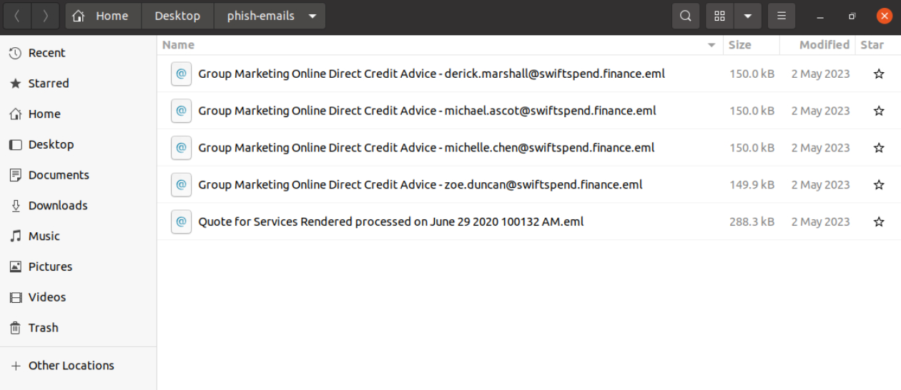

The first one, addressed to William McClean, carries the subject **"Quote for Services Rendered"** and opens with a classic BEC pretext:

> *"As discussed, please find attached quote."*

"As discussed" implies a conversation that never happened — it's built to make the recipient think they forgot something rather than stop and scrutinize a cold email. This reads as targeted invoice-fraud framing, not a spray-and-pray mass phish.

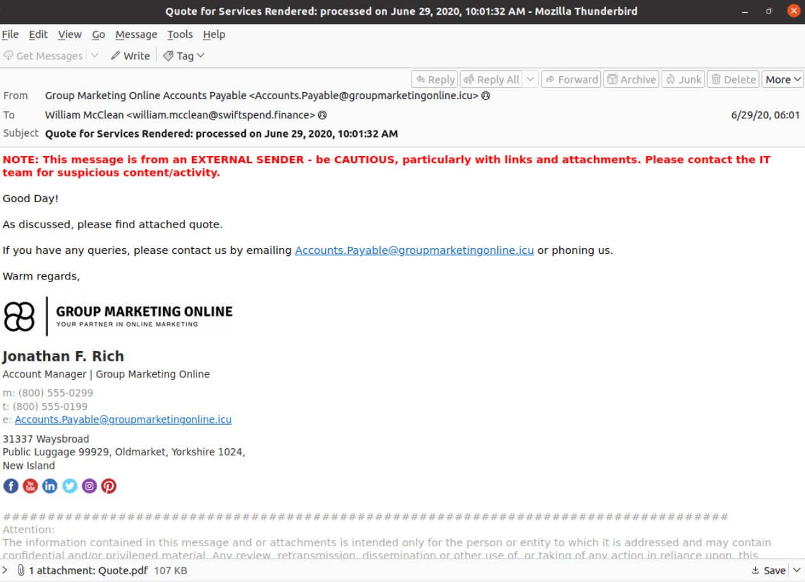
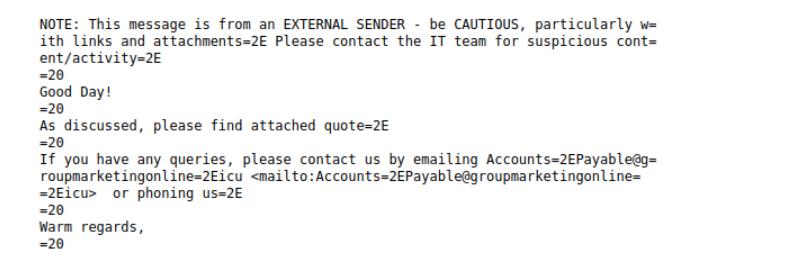

### 2.2 Header Analysis — Wave 1 (William McClean)
**MITRE ATT&CK:** `T1036.005` — Masquerading: Match Legitimate Name or Location

Traced the routing path bottom-to-top (oldest to newest hop): originated at `m-msa-com01.srv.mmtr.basmail.jp` (07:01:58 +0900, Japan), through `m-out-com.basmail.jp`, into Microsoft's EOP/O365 infrastructure, then landed internally at SwiftSpend's mail servers.

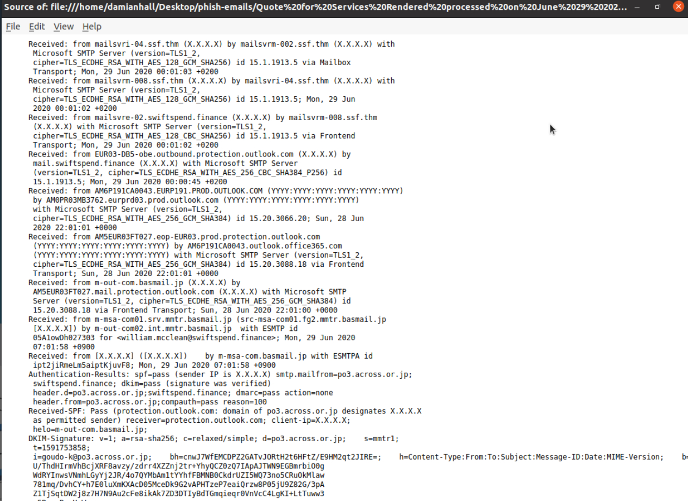

SPF, DKIM, and DMARC all **passed** — but they passed for `po3.across.or.jp`, not `swiftspend.finance` or the address the victim actually sees. This isn't a spoofed/failed-auth email; the attacker sent from infrastructure they legitimately control, so it authenticates cleanly at the protocol level, which is exactly what makes it dangerous.

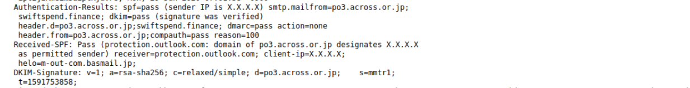

Three domains are doing three different jobs here:

| Domain | Role |
|---|---|
| `swiftspend.finance` | Target organization |
| `po3.across.or.jp` | Authenticated sending domain (SPF/DKIM/DMARC pass) |
| `groupmarketingonline.icu` | Visible `From:` / display identity the victim sees |

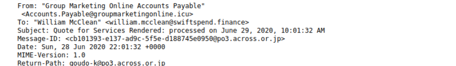

SPF/DKIM/DMARC only validate the envelope domain — none of them say anything about what's displayed to a human. An email can pass every automated check while showing the victim a completely different, unauthenticated identity. That's the gap this whole attack rides on.

### 2.3 Header Analysis — Wave 2 (Zoe Duncan, Derrick Marshall, Michael Ascot, Michelle Chen)
**MITRE ATT&CK:** `T1036.005` — Masquerading: Match Legitimate Name or Location

Four more employees got a second, related but distinct email: **"Group Marketing Online Direct Credit Advice."** Same banner, same signature block (Jonathan F. Rich / Group Marketing Online), same visible sender — but a different pretext, and different infrastructure entirely from Wave 1.

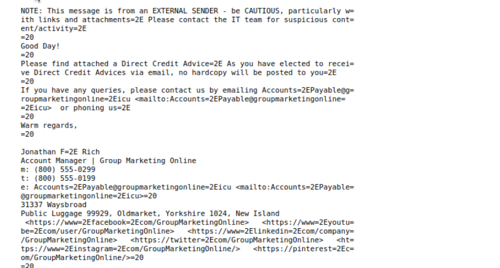

Pulled full headers on one of the four and spot-checked the remaining three for consistency (same Return-Path, same authentication pattern confirmed across all four):

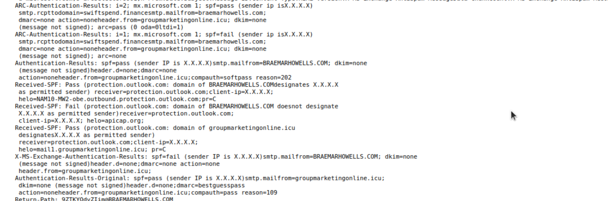
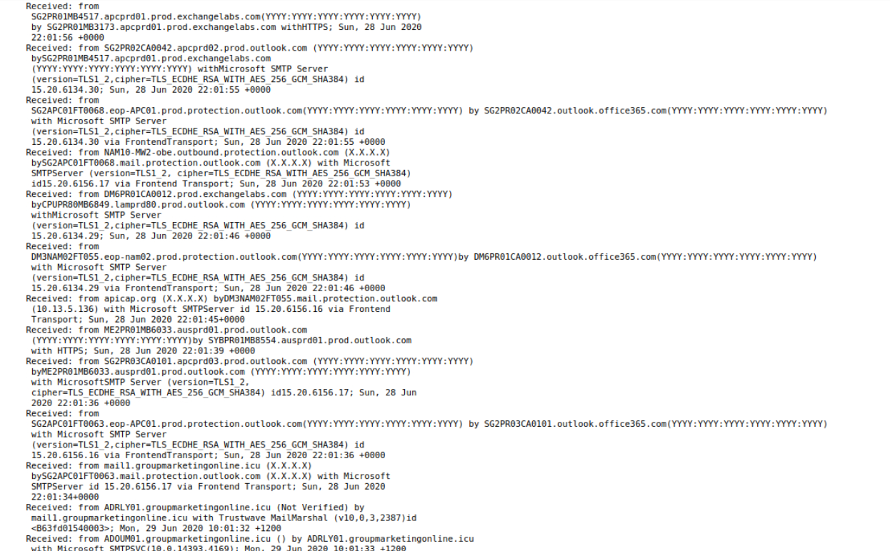

What's different from Wave 1:
- A third domain shows up — `BRAEMARHOWELLS.COM` — used as the `smtp.mailfrom`/`Return-Path`, with an auto-generated-looking local part (`9ZTKYOdvZIm@`)
- `dkim=none`, `dmarc=none`/`bestguesspass` — noticeably weaker than Wave 1's clean pass
- SPF results are inconsistent across relay hops for the same domain (`BRAEMARHOWELLS.COM` shows both `Pass` and `Fail` from different IPs in the same header block), suggesting more than one send attempt or relay path
- Microsoft's composite auth verdict lands at `compauth=softpass reason=202`, weaker than Wave 1's clean `compauth=pass reason=100`
- The `Received:` chain runs through mail servers actually branded to the visible domain (`mail1.groupmarketingonline.icu`, `ADRLY01.groupmarketingonline.icu`, running Trustwave MailMarshal — a real gateway product), unlike Wave 1 where the visible and authenticated domains had nothing to do with each other

Taken together, this wasn't one email template sent five times — it's two waves, two infrastructure setups, two authentication postures. That reads as deliberate, possibly the attacker testing which combination gets past filtering best.

### 2.4 Attachment & Redirect Analysis — Wave 1 (PDF)
**MITRE ATT&CK:** `T1566.001` Spearphishing Attachment &nbsp;|&nbsp; `T1204.002` User Execution: Malicious File &nbsp;|&nbsp; `T1027` Obfuscated Files or Information

McClean's email carried `Quote.pdf`. Hovering the "Access Document" button (without clicking) exposes the real redirect target first:

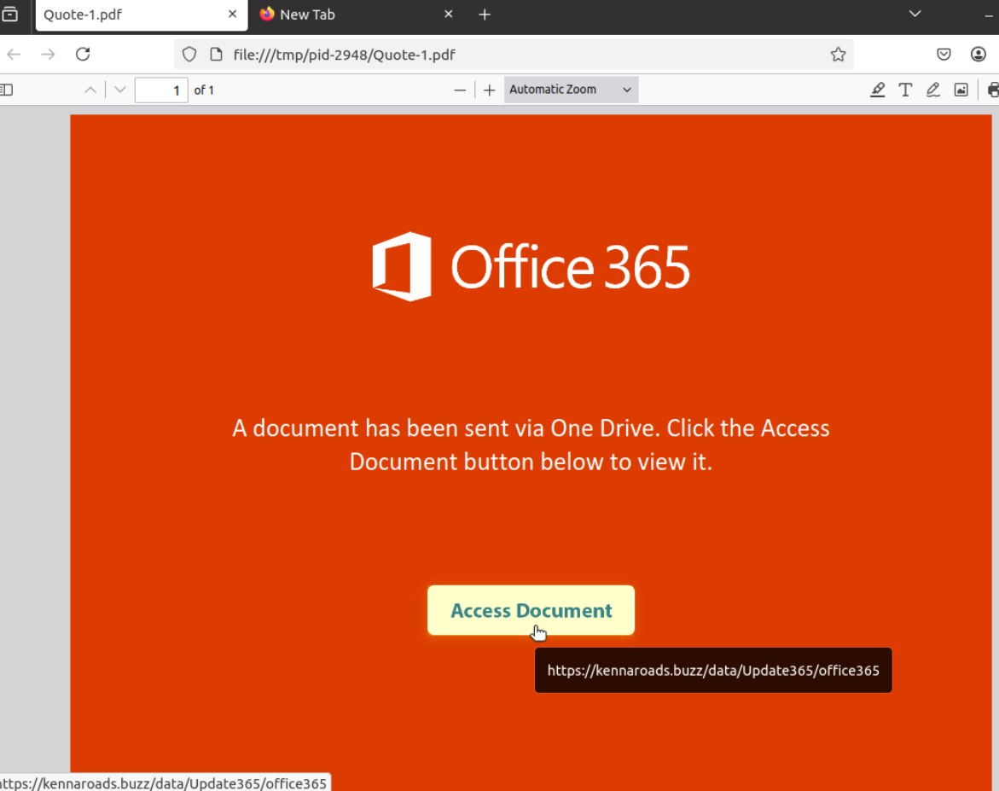

Redirect: `https://kennaroads.buzz/data/Update365/office365` — no relation to Microsoft, hosting an Office 365 login impersonation.

Hashed the PDF:

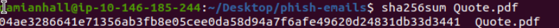

`SHA256: 04ae3286641e71356ab3fb8e05cee0da58d94a7f6afe49620d24831db33d3441`

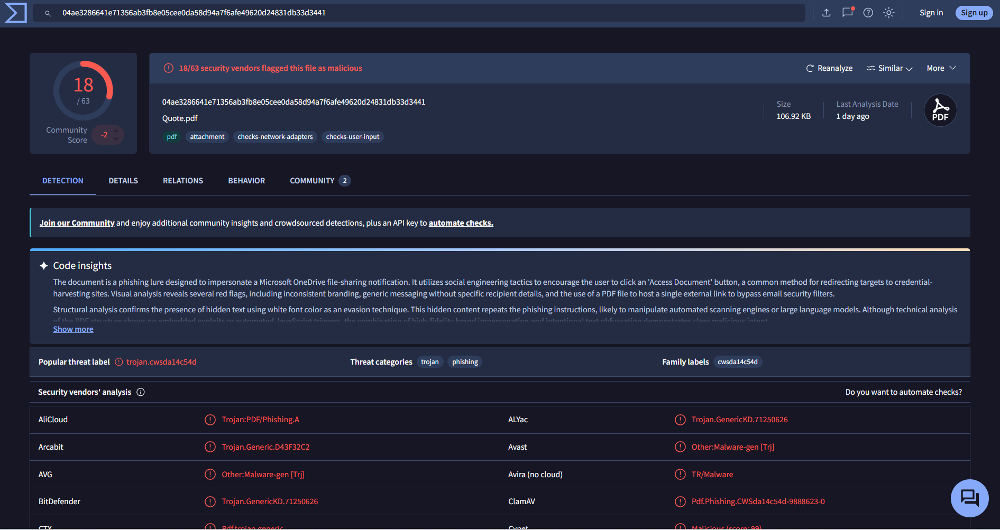

18/63 vendors flagged it malicious (`Trojan:PDF/Phishing.A` / `trojan.cwsda14c54d`). VirusTotal's own code-insights analysis caught the most interesting detail in the whole investigation:

> *"Structural analysis confirms the presence of hidden text using white font color as an evasion technique. This hidden content repeats the phishing instructions, likely to manipulate automated scanning engines or large language models."*

White-on-white text is an old trick against keyword filters, but this analysis specifically calls out LLM-targeted scanning evasion — a technique that's only become more relevant as AI-based email security has become common. Worth noting the PDF's detection rate (18/63) sits lower than the kit archive's (33/65, section 2.6) — consistent with the evasion actually doing something.

### 2.5 Attachment & Redirect Analysis — Wave 2 (HTML Redirect Files)
**MITRE ATT&CK:** `T1566.001` Spearphishing Attachment &nbsp;|&nbsp; `T1204.002` User Execution: Malicious File &nbsp;|&nbsp; `T1598.003` Phishing for Information: Spearphishing Link

The four Wave 2 emails each carried a `Direct Credit Advice.html` file instead of a PDF, a simpler direct redirect:

```html
<meta http-equiv="refresh" content="0;URL='http://kennaroads.buzz/data/Update365/office365/40e7baa2f826a57fcf04e5202526f8bd/?email={victim}@swiftspend.finance&error'" />
```

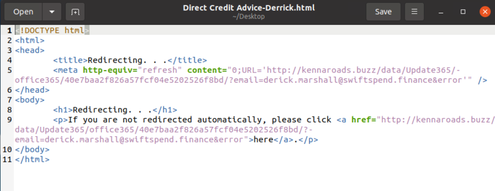
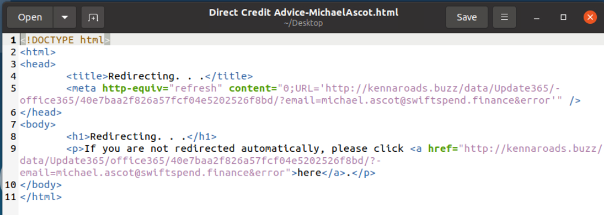
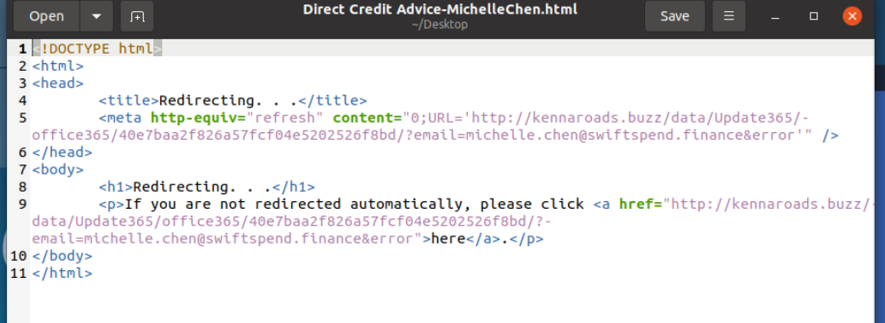
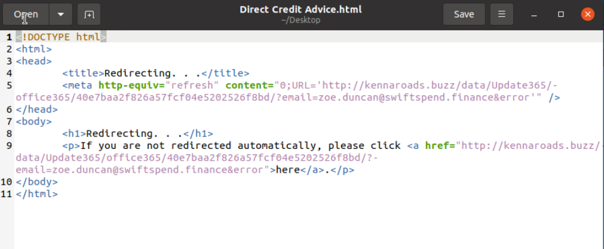

All four point to the **same hash path** (`40e7baa2f826a57fcf04e5202526f8bd`) — one shared kit instance, not a unique link per victim. Personalization comes from a `?email=` parameter the page reads client-side to pre-fill the login form, which is a simpler mechanism than true per-victim tracking tokens but still enough to make the fake page feel legitimate at a glance.

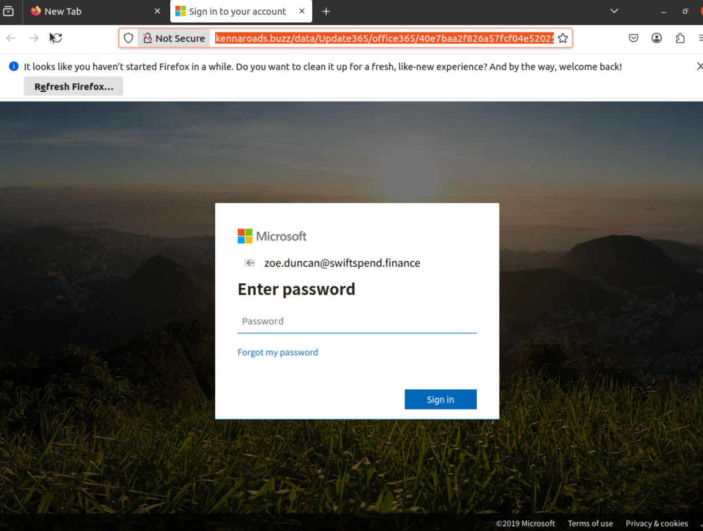

The trailing `&error` on every link is very likely deliberate — consistent with forcing the login page into a fake "wrong password, try again" state on load, which both catches typos on a first attempt and makes the flow feel like a real, occasionally-fallible login. This connects directly to a finding in 2.8.

### 2.6 Phishing Kit Retrieval & Teardown
**MITRE ATT&CK:** `T1497` Virtualization/Sandbox Evasion &nbsp;|&nbsp; `T1048.003` Exfiltration Over Unencrypted Non-C2 Protocol

The attacker's hosting had directory listing left on, an OPSEC mistake that exposed the entire kit for direct review:

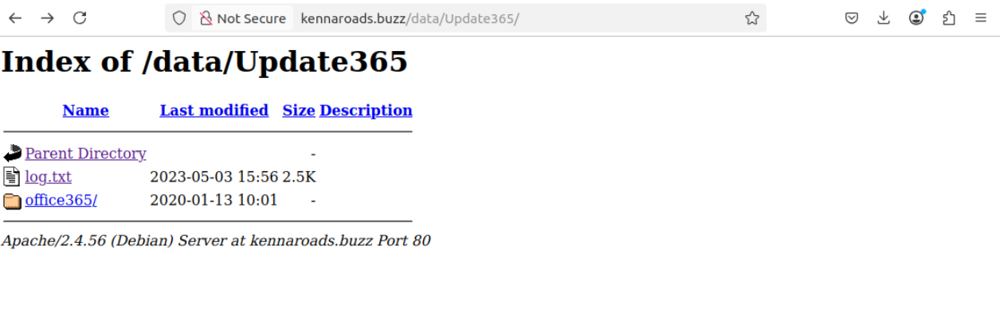

Downloaded `Update365.zip` and hashed it:

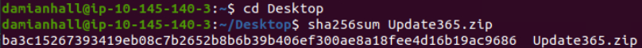

`SHA256: ba3c15267393419eb08c7b2652b8b6b39b406ef300ae8a18fee4d16b19ac9686`

VirusTotal: 33/65 vendors flagged malicious, 49 files inside.

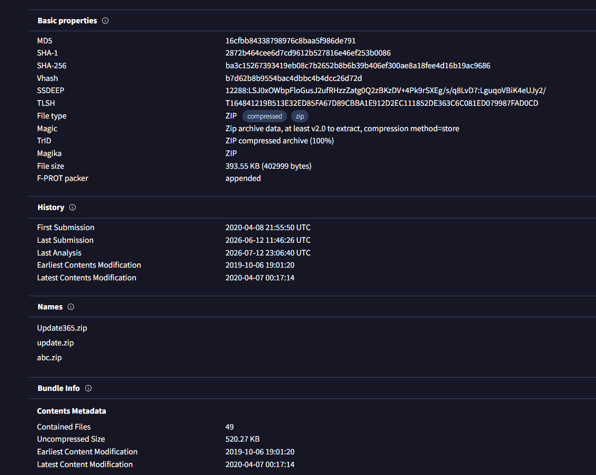
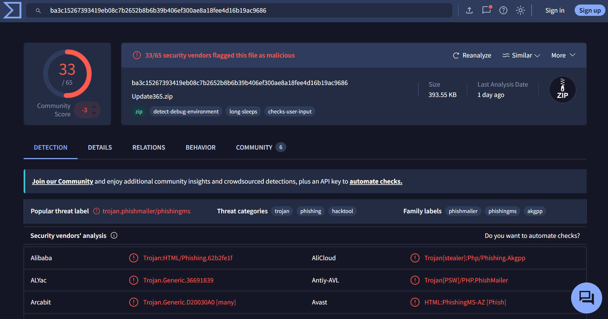

Popular threat label `trojan.phishmailer/phishingms`, categories **trojan, phishing, hacktool**. Behavioral tags: `detect-debug-environment`, `long-sleeps`, `checks-user-input` — this kit has active anti-sandbox behavior built in, it's not just a static credential form.

Reviewed `submit.php`, the credential collection endpoint:

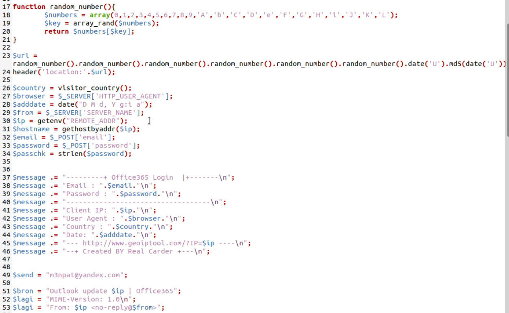

What the code actually does:
- Pulls `email` and `password` straight from `$_POST`, bundles them with the victim's IP, User-Agent, country (via `visitor_country()`), and timestamp into a formatted message
- Exfiltrates by email, not to a C2 server — captured data goes to `$send = "m3npat@yandex.com"`, so there's no external command-and-control infrastructure beyond a mailbox
- Builds a pseudo-random post-submission redirect — `random_number()` called six times, appended to a Unix timestamp and its MD5 hash — and sends the victim there via `header('location:'.$url)`, hiding the kit's behavior after capture rather than showing an obvious success or error page
- One sloppy detail worth flagging: the outbound exfil email's `From:` header is built using the victim's own IP address (`"From: $ip <no-reply@$from>"`), which sits oddly next to the deliberate anti-sandbox logic elsewhere. This reads as a commodity, mass-produced kit — internally branded **"Created BY Real Carder"** in its own output, likely a kit-builder or marketplace signature — rather than something custom-built for this campaign specifically.

### 2.7 Flag Retrieval (Lab Artifact)
**MITRE ATT&CK:** not applicable — room-specific CTF artifact, not adversary tradecraft

Found `flag.txt` at the kit's web root:

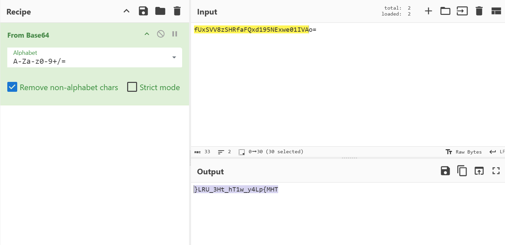

Decoded via CyberChef (From Base64):

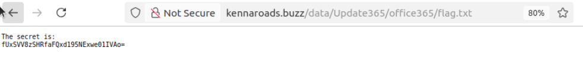

Output came back reversed; read backwards the flag is **`THM{pL4y_w1Th_tH3_URL}`**.

### 2.8 Credential Harvest Analysis (`log.txt`)
**MITRE ATT&CK:** `T1589.001` Gather Victim Identity Information: Credentials

Same open directory exposed `log.txt` with raw submitted credentials:

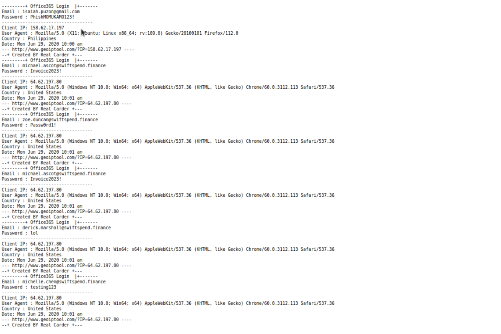

What actually matters here, beyond just reading off names and passwords:

1. **4 of 5 targeted employees appear in the log** with submitted credentials — Zoe Duncan, Michael Ascot, Derrick Marshall, Michelle Chen. **William McClean does not appear**, meaning either he didn't submit, or his PDF-vector path logs somewhere this file doesn't capture.

2. **All four SwiftSpend entries share one IP (`64.62.197.80`) and one identical User-Agent string**, submitted inside the same minute. Four different people at four different desks don't produce that. Most likely explanation: the attacker replaying or testing captured credentials themselves rather than these being four independent live victim sessions — though it could also be an artifact of how the lab generated its sample data. Flagging the inconsistency and reasoning through it, rather than picking one explanation and stating it as fact, is the actual analysis here.

3. **`michael.ascot@swiftspend.finance` submitted twice** — same password, same IP, one minute apart. Lines up with the `&error` parameter from 2.5: consistent with the kit forcing a fake "wrong password" prompt to induce a second entry.

4. **One entry doesn't belong to this campaign at all**: `isaiah.puzon@gmail.com`, from a Philippines IP (`158.62.17.197`), timestamped earlier than the other four, personal Gmail unrelated to SwiftSpend. Assessed as out of scope — most likely the attacker's own test submission while validating the kit, or an unrelated third party who stumbled onto the exposed page. Excluded from campaign scope rather than folded in.

## 3. Containment, Eradication & Recovery

- **Password reset and session/token revocation** for all four confirmed-compromised accounts (michael.ascot, zoe.duncan, derick.marshall, michelle.chen), and a precautionary reset for william.mcclean pending further log review since his outcome isn't confirmed either way.
- **Block at the email gateway**: `groupmarketingonline.icu`, `po3.across.or.jp`, `BRAEMARHOWELLS.COM`, and the redirect/credential-harvest domain `kennaroads.buzz`.
- **Search org-wide mail logs** for any recipients of either wave beyond the 5 identified here — two separate waves suggests the actual target list may be larger than what got reported.
- **Report the exposed attacker infrastructure** (open directory at `kennaroads.buzz`) to relevant abuse/takedown contacts, since it's still actively exposing victim data.

## 4. Post-Incident Activity

- **Submit IOCs** (domains, both file hashes, the exfil address) to whatever threat intel sharing SwiftSpend participates in.
- **Test email security tooling against LLM-targeted evasion specifically** — the PDF's hidden-text technique aimed at AI scanners is a forward-looking gap worth checking current filtering against, not just a historical curiosity.
- **Review whether the external-sender banner and escalation process should be called out as a success story internally** — it worked here, and reinforcing that employees did the right thing by reporting is worth more than only ever messaging about what went wrong.

### Lessons Learned
- Two emails that look like they're "from the same attacker" based on body content and branding can still come from genuinely different infrastructure — worth confirming per-wave rather than assuming shared origin from content alone.
- Passing SPF/DKIM/DMARC only proves the sender controls *some* domain, not that it's the right one. Always check the authenticated domain against what's actually displayed to the victim.
- Automated tool output can surface things a manual pass misses entirely — the hidden-text/LLM-evasion finding here came straight from reading VirusTotal's full analysis, not from anything in the raw file itself.
- Attacker infrastructure mistakes (open directory listings, in this case) are a legitimate, routine thing to check for, not just a lucky break.

---

## Indicators of Compromise (IOCs)

| Type | Value | Role / Verdict |
|---|---|---|
| Visible sender domain (Wave 1) | `groupmarketingonline.icu` | Display-spoofed identity — Malicious |
| Authenticated sending domain (Wave 1) | `po3.across.or.jp` | SPF/DKIM/DMARC pass — attacker-controlled infra |
| Sending domain (Wave 2) | `BRAEMARHOWELLS.COM` / `groupmarketingonline.icu` | Weak/inconsistent auth — Malicious |
| Redirect / credential-harvest domain | `kennaroads.buzz` | Fake Microsoft 365 login — Malicious |
| Phishing kit archive (SHA256) | `ba3c15267393419eb08c7b2652b8b6b39b406ef300ae8a18fee4d16b19ac9686` | 33/65 VT — Trojan/Phishing/Hacktool |
| PDF delivery attachment (SHA256) | `04ae3286641e71356ab3fb8e05cee0da58d94a7f6afe49620d24831db33d3441` | 18/63 VT — Trojan:PDF/Phishing.A |
| Credential exfil destination | `m3npat@yandex.com` | Attacker-controlled mailbox |
| Confirmed compromised accounts | michael.ascot@, zoe.duncan@, derick.marshall@, michelle.chen@swiftspend.finance | Credentials confirmed in exposed log |
| Excluded/unrelated log entry | isaiah.puzon@gmail.com | Out of scope — not a SwiftSpend target |

*Sender/relay IP addresses in the email headers were redacted by the lab environment (shown as `X.X.X.X`); the IPs above are limited to those that appeared unredacted in the credential-harvest log.*

## MITRE ATT&CK Mapping (Summary)

Each technique is tagged inline in section 2 next to the specific evidence that confirms it — this table is a consolidated view, not the primary source.

| Technique ID | Technique Name | Evidence | Section |
|---|---|---|---|
| T1036.005 | Masquerading: Match Legitimate Name or Location | Display-spoofed sender identity across both waves | 2.2, 2.3 |
| T1566.001 | Phishing: Spearphishing Attachment | Wave 1 PDF; Wave 2 HTML redirect files | 2.4, 2.5 |
| T1204.002 | User Execution: Malicious File | Victims opening the PDF / HTML attachment | 2.4, 2.5 |
| T1027 | Obfuscated Files or Information | Hidden white-text in PDF, scanner/LLM evasion | 2.4 |
| T1598.003 | Phishing for Information: Spearphishing Link | Fake Microsoft 365 credential-harvest page | 2.5 |
| T1497 | Virtualization/Sandbox Evasion | Kit tags: `detect-debug-environment`, `long-sleeps` | 2.6 |
| T1048.003 | Exfiltration Over Unencrypted Non-C2 Protocol | Credential exfil via PHP `mail()`, no C2 infra | 2.6 |
| T1589.001 | Gather Victim Identity Information: Credentials | Credentials recovered from exposed `log.txt` | 2.8 |

## Scope & Impact

- 5 SwiftSpend Financial employees targeted across two coordinated waves
- 2 distinct delivery mechanisms (PDF vs. direct HTML redirect) and 2 distinct sending infrastructures — deliberate multi-pronged tradecraft, not one template reused
- 4 of 5 employees had credentials captured, including one duplicate submission consistent with a forced re-entry flow
- 1 employee (McClean) shows no confirmed credential capture in available evidence
- Attacker infrastructure had directory listing misconfigured, exposing the full kit, credential log, and flag artifact — a significant OPSEC failure on the adversary's part that enabled this depth of investigation

## Verdict

Confirmed, active, multi-victim phishing and credential-harvesting campaign, not an isolated incident. The adversary combined display-name spoofing, a low-detection PDF lure with scanner/LLM-targeted evasion text, and a commodity phishing kit with working anti-sandbox behavior to compromise at least 4 of 5 targeted accounts.
